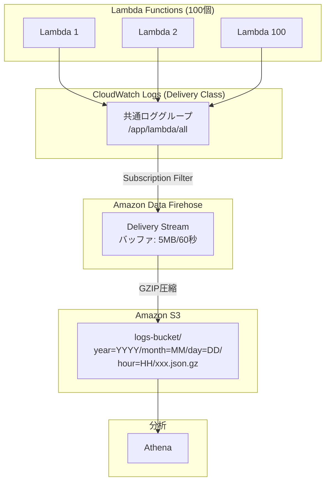
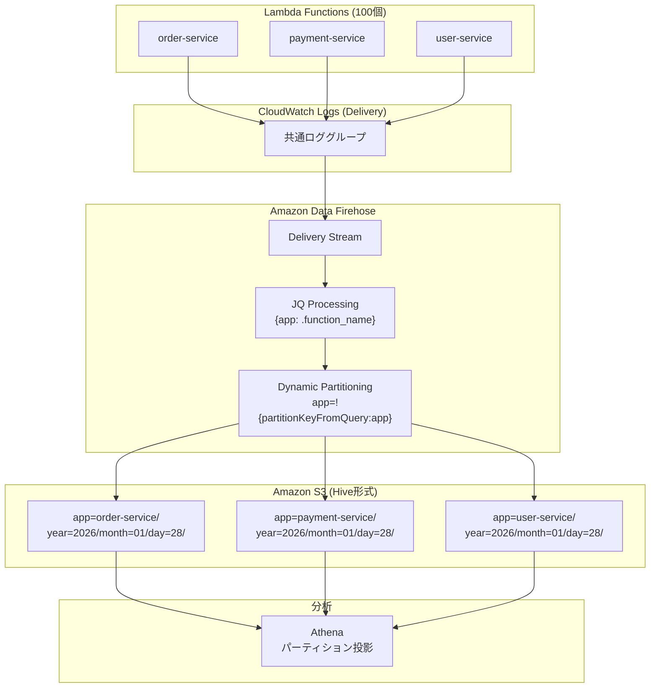
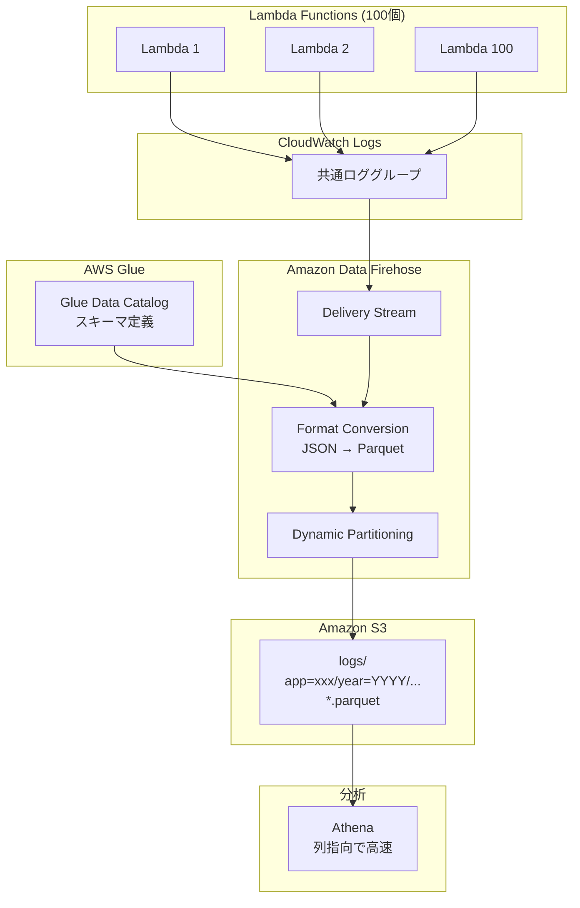
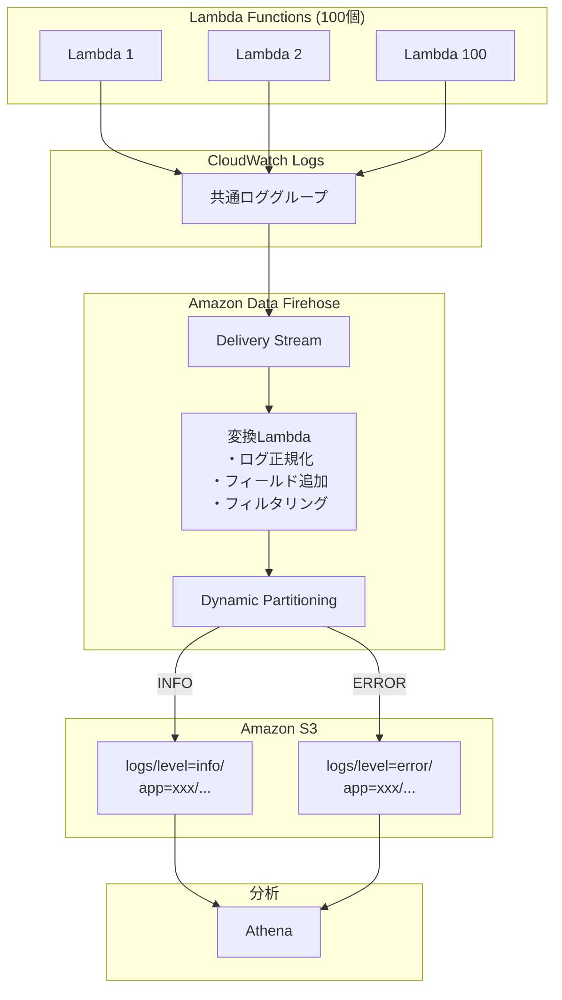
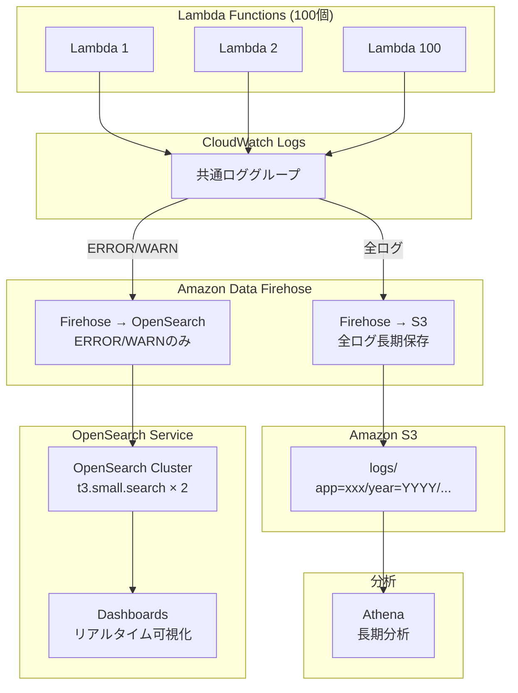

# Firehose を使ったログ管理 - 実装パターン検討

## 前提条件

| 項目 | 値 |
|------|-----|
| Lambda関数数 | 100個 |
| ランタイム | .NET 8 (C#) |
| 月間ログ量（想定） | 100GB |
| アプリ別パーティション | 必要（100アプリ） |
| 日付別パーティション | 必要（year/month/day） |
| リージョン | ap-northeast-1 (東京) |

## Firehose 課金要素

| 項目 | 単価 (東京) | 備考 |
|------|------------|------|
| **データ取り込み (Direct PUT/KDS)** | $0.036/GB | 5KB単位で切り上げ |
| **データ取り込み (Vended Logs)** | $0.13/GB | CloudWatch Logs経由 |
| **フォーマット変換 (Parquet/ORC)** | $0.023/GB | オプション |
| **動的パーティショニング** | $0.025/GB | オプション |
| **S3オブジェクト配信** | $0.0065/1000件 | 動的パーティション時 |
| **JQ処理** | $0.09/時間 | 動的パーティション時 |
| **CloudWatch Logs 解凍** | $0.0042/GB | Vended Logs時 |
| **VPC配信** | $0.013/GB + $0.013/AZ時間 | VPC内宛先時 |

---

## 構成パターン比較サマリ

| # | パターン名 | コスト/月 | Athena最適化 | リアルタイム性 | 推奨度 |
|---|-----------|----------|-------------|--------------|--------|
| 1 | 基本構成（JSON） | ~$31 | △ | ○ | ○ |
| 2 | 動的パーティショニング | ~$35 | ◎ | ○ | ◎ |
| 3 | Parquet変換 | ~$34 | ◎ | △ | ◎ |
| 4 | Lambda変換 + 動的パーティション | ~$38 | ◎ | ○ | ○ |
| 5 | マルチ宛先（S3 + OpenSearch） | ~$85 | ◎ | ◎ | △ |

---

## パターン1: 基本構成（JSON）

### 概要
最もシンプルな構成。CloudWatch Logs → Firehose → S3 にJSON形式で配信。

### 構成図



### 費用内訳 (100GB/月)

| 項目 | 計算 | 費用/月 |
|------|------|--------|
| CloudWatch Logs 取り込み (Delivery) | 100GB × $0.25 | $25.00 |
| Firehose 取り込み (Vended Logs) | 100GB × $0.13 | **$0.00** ※ |
| CloudWatch Logs 解凍 | 100GB × $0.0042 | $0.42 |
| S3 ストレージ | 100GB × $0.025 | $2.50 |
| S3 PUT リクエスト | ~2,000件 × $0.0047/1000 | $0.01 |
| **合計** | | **~$27.93** |

※ Vended Logs経由の場合、Firehose取り込み料金は CloudWatch Logs 配信料金に含まれる

### S3パス構造
```
s3://logs-bucket/
└── 2026/01/28/23/
    └── logs-stream-1-2026-01-28-23-30-00-abc123.json.gz
```

### Terraform実装

```hcl
# Firehose Delivery Stream（基本構成）
resource "aws_kinesis_firehose_delivery_stream" "basic" {
  name        = "lambda-logs-basic"
  destination = "extended_s3"

  extended_s3_configuration {
    role_arn   = aws_iam_role.firehose.arn
    bucket_arn = aws_s3_bucket.logs.arn

    # タイムスタンプベースのプレフィックス
    prefix              = "logs/year=!{timestamp:yyyy}/month=!{timestamp:MM}/day=!{timestamp:dd}/hour=!{timestamp:HH}/"
    error_output_prefix = "errors/!{firehose:error-output-type}/!{timestamp:yyyy/MM/dd}/"

    # バッファ設定
    buffering_size     = 5   # MB (1-128)
    buffering_interval = 60  # 秒 (0-900)

    # 圧縮設定
    compression_format = "GZIP"

    # CloudWatch メトリクス
    cloudwatch_logging_options {
      enabled         = true
      log_group_name  = "/aws/firehose/lambda-logs-basic"
      log_stream_name = "S3Delivery"
    }
  }
}

# CloudWatch Logs Subscription Filter
resource "aws_cloudwatch_log_subscription_filter" "to_firehose" {
  name            = "all-logs-to-firehose"
  log_group_name  = aws_cloudwatch_log_group.lambda_logs.name
  filter_pattern  = ""
  destination_arn = aws_kinesis_firehose_delivery_stream.basic.arn
  role_arn        = aws_iam_role.cloudwatch_to_firehose.arn
}
```

### メリット・デメリット

| メリット | デメリット |
|---------|-----------|
| 設定がシンプル | アプリ別にディレクトリ分離されない |
| コストが最も低い | Athenaクエリが遅い（全スキャン） |
| 運用が容易 | パーティション投影が使えない |

---

## パターン2: 動的パーティショニング（推奨）

### 概要
JQでアプリ名を抽出し、アプリ別・日付別にS3パスを動的に生成。Athena最適化。

### 構成図



### 費用内訳 (100GB/月)

| 項目 | 計算 | 費用/月 |
|------|------|--------|
| CloudWatch Logs 取り込み (Delivery) | 100GB × $0.25 | $25.00 |
| CloudWatch Logs 解凍 | 100GB × $0.0042 | $0.42 |
| **動的パーティショニング** | 100GB × $0.025 | $2.50 |
| **S3オブジェクト配信** | ~72,000件 × $0.0065/1000 | $0.47 |
| **JQ処理時間** | ~10時間 × $0.09 | $0.90 |
| S3 ストレージ | 100GB × $0.025 | $2.50 |
| **合計** | | **~$31.79** |

※ S3オブジェクト数: 100アプリ × 24時間 × 30日 = 72,000件/月

### S3パス構造（Hive互換）
```
s3://logs-bucket/
└── logs/
    ├── app=order-service/
    │   └── year=2026/
    │       └── month=01/
    │           └── day=28/
    │               └── hour=23/
    │                   └── data-xxx.json.gz
    ├── app=payment-service/
    │   └── ...
    └── app=user-service/
        └── ...
```

### Terraform実装

```hcl
resource "aws_kinesis_firehose_delivery_stream" "dynamic_partition" {
  name        = "lambda-logs-dynamic"
  destination = "extended_s3"

  extended_s3_configuration {
    role_arn   = aws_iam_role.firehose.arn
    bucket_arn = aws_s3_bucket.logs.arn

    # 動的パーティショニング有効化
    dynamic_partitioning_configuration {
      enabled = true
    }

    # Hive互換プレフィックス
    prefix = "logs/app=!{partitionKeyFromQuery:app}/year=!{timestamp:yyyy}/month=!{timestamp:MM}/day=!{timestamp:dd}/hour=!{timestamp:HH}/"
    error_output_prefix = "errors/!{firehose:error-output-type}/!{timestamp:yyyy/MM/dd}/"

    # バッファ設定（動的パーティション時は小さめ推奨）
    buffering_size     = 64  # MB
    buffering_interval = 60  # 秒

    compression_format = "GZIP"

    # メタデータ抽出（JQ）
    processing_configuration {
      enabled = true

      # アプリ名抽出
      processors {
        type = "MetadataExtraction"
        parameters {
          parameter_name  = "MetadataExtractionQuery"
          parameter_value = "{app: .function_name}"
        }
        parameters {
          parameter_name  = "JsonParsingEngine"
          parameter_value = "JQ-1.6"
        }
      }

      # 改行デリミタ追加（Athena用）
      processors {
        type = "AppendDelimiterToRecord"
        parameters {
          parameter_name  = "Delimiter"
          parameter_value = "\\n"
        }
      }
    }
  }
}
```

### Athena テーブル定義（パーティション投影）

```sql
CREATE EXTERNAL TABLE lambda_logs (
    timestamp string,
    level string,
    function_name string,
    message string,
    request_id string,
    cold_start boolean,
    xray_trace_id string
)
PARTITIONED BY (
    app string,
    year int,
    month int,
    day int,
    hour int
)
ROW FORMAT SERDE 'org.openx.data.jsonserde.JsonSerDe'
LOCATION 's3://logs-bucket/logs/'
TBLPROPERTIES (
    'projection.enabled' = 'true',
    'projection.app.type' = 'enum',
    'projection.app.values' = 'order-service,payment-service,user-service,...',
    'projection.year.type' = 'integer',
    'projection.year.range' = '2024,2030',
    'projection.month.type' = 'integer',
    'projection.month.range' = '1,12',
    'projection.month.digits' = '2',
    'projection.day.type' = 'integer',
    'projection.day.range' = '1,31',
    'projection.day.digits' = '2',
    'projection.hour.type' = 'integer',
    'projection.hour.range' = '0,23',
    'projection.hour.digits' = '2',
    'storage.location.template' = 's3://logs-bucket/logs/app=${app}/year=${year}/month=${month}/day=${day}/hour=${hour}/'
);
```

### メリット・デメリット

| メリット | デメリット |
|---------|-----------|
| アプリ別にS3パスが分離 | 基本構成より若干コスト増 |
| Athenaクエリが高速 | S3オブジェクト数が増加 |
| パーティション投影対応 | JQ構文の学習コスト |

---

## パターン3: Parquet変換

### 概要
Glueスキーマを使ってParquet形式に変換。Athenaクエリコストを大幅削減。

### 構成図



### 費用内訳 (100GB/月)

| 項目 | 計算 | 費用/月 |
|------|------|--------|
| CloudWatch Logs 取り込み (Delivery) | 100GB × $0.25 | $25.00 |
| CloudWatch Logs 解凍 | 100GB × $0.0042 | $0.42 |
| **フォーマット変換** | 100GB × $0.023 | $2.30 |
| 動的パーティショニング | 100GB × $0.025 | $2.50 |
| S3オブジェクト配信 | ~72,000件 × $0.0065/1000 | $0.47 |
| JQ処理時間 | ~10時間 × $0.09 | $0.90 |
| S3 ストレージ (Parquet圧縮後 ~30GB) | 30GB × $0.025 | $0.75 |
| **合計** | | **~$32.34** |

### Terraform実装

```hcl
# Glue Database & Table
resource "aws_glue_catalog_database" "logs" {
  name = "lambda_logs_db"
}

resource "aws_glue_catalog_table" "logs" {
  name          = "logs"
  database_name = aws_glue_catalog_database.logs.name

  table_type = "EXTERNAL_TABLE"

  parameters = {
    classification = "parquet"
  }

  storage_descriptor {
    location      = "s3://${aws_s3_bucket.logs.id}/logs/"
    input_format  = "org.apache.hadoop.hive.ql.io.parquet.MapredParquetInputFormat"
    output_format = "org.apache.hadoop.hive.ql.io.parquet.MapredParquetOutputFormat"

    ser_de_info {
      serialization_library = "org.apache.hadoop.hive.ql.io.parquet.serde.ParquetHiveSerDe"
    }

    columns {
      name = "timestamp"
      type = "string"
    }
    columns {
      name = "level"
      type = "string"
    }
    columns {
      name = "function_name"
      type = "string"
    }
    columns {
      name = "message"
      type = "string"
    }
    columns {
      name = "request_id"
      type = "string"
    }
    columns {
      name = "cold_start"
      type = "boolean"
    }
  }
}

# Firehose with Parquet Conversion
resource "aws_kinesis_firehose_delivery_stream" "parquet" {
  name        = "lambda-logs-parquet"
  destination = "extended_s3"

  extended_s3_configuration {
    role_arn   = aws_iam_role.firehose.arn
    bucket_arn = aws_s3_bucket.logs.arn

    dynamic_partitioning_configuration {
      enabled = true
    }

    prefix              = "logs/app=!{partitionKeyFromQuery:app}/year=!{timestamp:yyyy}/month=!{timestamp:MM}/day=!{timestamp:dd}/hour=!{timestamp:HH}/"
    error_output_prefix = "errors/!{firehose:error-output-type}/!{timestamp:yyyy/MM/dd}/"

    buffering_size     = 128  # Parquet変換時は大きめ推奨
    buffering_interval = 300  # 5分

    # フォーマット変換設定
    data_format_conversion_configuration {
      enabled = true

      input_format_configuration {
        deserializer {
          open_x_json_ser_de {}
        }
      }

      output_format_configuration {
        serializer {
          parquet_ser_de {
            compression = "SNAPPY"
          }
        }
      }

      schema_configuration {
        database_name = aws_glue_catalog_database.logs.name
        table_name    = aws_glue_catalog_table.logs.name
        role_arn      = aws_iam_role.firehose.arn
      }
    }

    processing_configuration {
      enabled = true

      processors {
        type = "MetadataExtraction"
        parameters {
          parameter_name  = "MetadataExtractionQuery"
          parameter_value = "{app: .function_name}"
        }
        parameters {
          parameter_name  = "JsonParsingEngine"
          parameter_value = "JQ-1.6"
        }
      }
    }
  }
}
```

### メリット・デメリット

| メリット | デメリット |
|---------|-----------|
| S3ストレージが約70%削減 | Glueスキーマ管理が必要 |
| Athenaクエリコスト大幅削減 | バッファ時間が長くなる（5分推奨） |
| 列指向で分析が高速 | スキーマ変更時に注意が必要 |

---

## パターン4: Lambda変換 + 動的パーティション

### 概要
Firehose内でLambda関数を使ってログを加工・フィルタリング。柔軟なデータ変換が可能。

### 構成図



### 費用内訳 (100GB/月)

| 項目 | 計算 | 費用/月 |
|------|------|--------|
| CloudWatch Logs 取り込み (Delivery) | 100GB × $0.25 | $25.00 |
| CloudWatch Logs 解凍 | 100GB × $0.0042 | $0.42 |
| 動的パーティショニング | 100GB × $0.025 | $2.50 |
| S3オブジェクト配信 | ~144,000件 × $0.0065/1000 | $0.94 |
| JQ処理時間 | ~10時間 × $0.09 | $0.90 |
| **変換Lambda** | ~2,000呼出 × 512MB × 1秒 | $1.67 |
| S3 ストレージ | 100GB × $0.025 | $2.50 |
| **合計** | | **~$33.93** |

### 変換Lambda実装 (C#)

```csharp
using Amazon.Lambda.Core;
using Amazon.Lambda.KinesisFirehoseEvents;
using System.Text;
using System.Text.Json;

[assembly: LambdaSerializer(typeof(Amazon.Lambda.Serialization.SystemTextJson.DefaultLambdaJsonSerializer))]

namespace FirehoseTransformer;

public class Function
{
    public KinesisFirehoseResponse FunctionHandler(
        KinesisFirehoseEvent firehoseEvent, 
        ILambdaContext context)
    {
        var response = new KinesisFirehoseResponse
        {
            Records = new List<KinesisFirehoseResponse.FirehoseRecord>()
        };

        foreach (var record in firehoseEvent.Records)
        {
            try
            {
                // Base64デコード
                var data = Convert.FromBase64String(record.Data);
                var json = Encoding.UTF8.GetString(data);
                var logEntry = JsonSerializer.Deserialize<LogEntry>(json);

                // ログレベルでフィルタリング（DEBUGは除外）
                if (logEntry?.Level == "Debug")
                {
                    response.Records.Add(new KinesisFirehoseResponse.FirehoseRecord
                    {
                        RecordId = record.RecordId,
                        Result = KinesisFirehoseResponse.DROPPED
                    });
                    continue;
                }

                // フィールド追加・正規化
                var enriched = new
                {
                    logEntry.Timestamp,
                    logEntry.Level,
                    logEntry.FunctionName,
                    logEntry.Message,
                    logEntry.RequestId,
                    // 追加フィールド
                    processed_at = DateTime.UtcNow.ToString("o"),
                    environment = Environment.GetEnvironmentVariable("ENVIRONMENT") ?? "unknown"
                };

                var outputJson = JsonSerializer.Serialize(enriched) + "\n";
                var outputData = Convert.ToBase64String(Encoding.UTF8.GetBytes(outputJson));

                response.Records.Add(new KinesisFirehoseResponse.FirehoseRecord
                {
                    RecordId = record.RecordId,
                    Result = KinesisFirehoseResponse.TRANSFORMED_STATE_OK,
                    Data = outputData,
                    Metadata = new KinesisFirehoseResponse.FirehoseRecordMetadata
                    {
                        PartitionKeys = new Dictionary<string, string>
                        {
                            ["app"] = logEntry.FunctionName ?? "unknown",
                            ["level"] = logEntry.Level?.ToLower() ?? "info"
                        }
                    }
                });
            }
            catch (Exception ex)
            {
                context.Logger.LogError($"Error processing record: {ex.Message}");
                response.Records.Add(new KinesisFirehoseResponse.FirehoseRecord
                {
                    RecordId = record.RecordId,
                    Result = KinesisFirehoseResponse.PROCESSING_FAILED
                });
            }
        }

        return response;
    }
}

public class LogEntry
{
    public string? Timestamp { get; set; }
    public string? Level { get; set; }
    public string? FunctionName { get; set; }
    public string? Message { get; set; }
    public string? RequestId { get; set; }
}
```

### Terraform実装

```hcl
resource "aws_kinesis_firehose_delivery_stream" "with_lambda" {
  name        = "lambda-logs-transformed"
  destination = "extended_s3"

  extended_s3_configuration {
    role_arn   = aws_iam_role.firehose.arn
    bucket_arn = aws_s3_bucket.logs.arn

    dynamic_partitioning_configuration {
      enabled = true
    }

    # レベル別 + アプリ別パーティション
    prefix = "logs/level=!{partitionKeyFromLambda:level}/app=!{partitionKeyFromLambda:app}/year=!{timestamp:yyyy}/month=!{timestamp:MM}/day=!{timestamp:dd}/"
    error_output_prefix = "errors/!{firehose:error-output-type}/!{timestamp:yyyy/MM/dd}/"

    buffering_size     = 64
    buffering_interval = 60

    processing_configuration {
      enabled = true

      processors {
        type = "Lambda"
        parameters {
          parameter_name  = "LambdaArn"
          parameter_value = "${aws_lambda_function.transformer.arn}:$LATEST"
        }
        parameters {
          parameter_name  = "BufferSizeInMBs"
          parameter_value = "1"
        }
        parameters {
          parameter_name  = "BufferIntervalInSeconds"
          parameter_value = "60"
        }
      }
    }
  }
}
```

### メリット・デメリット

| メリット | デメリット |
|---------|-----------|
| 柔軟なデータ変換が可能 | Lambda実装・保守コスト |
| フィルタリングでストレージ削減 | Lambda障害時のリスク |
| レベル別パーティションも可能 | 変換Lambdaの課金 |

---

## パターン5: マルチ宛先（S3 + OpenSearch）

### 概要
S3への長期保存と、OpenSearchでのリアルタイム検索を両立。高コストだが高機能。

### 構成図



### 費用内訳 (100GB/月、ERROR/WARN 6GB)

| 項目 | 計算 | 費用/月 |
|------|------|--------|
| **S3配信分** | | |
| └ CloudWatch Logs (Delivery) | 100GB × $0.25 | $25.00 |
| └ CloudWatch Logs 解凍 | 100GB × $0.0042 | $0.42 |
| └ 動的パーティショニング | 100GB × $0.025 | $2.50 |
| └ S3オブジェクト配信 | ~72,000件 × $0.0065/1000 | $0.47 |
| └ S3 ストレージ | 100GB × $0.025 | $2.50 |
| **OpenSearch配信分** | | |
| └ CloudWatch Logs (Standard) | 6GB × $0.50 | $3.00 |
| └ Firehose (Direct PUT) | 6GB × $0.036 | $0.22 |
| **OpenSearch クラスタ** | | |
| └ t3.small.search × 2 | 2 × $0.036 × 720h | $51.84 |
| └ EBS (20GB × 2) | 40GB × $0.135 | $5.40 |
| **合計** | | **~$91.35** |

### Terraform実装（OpenSearch部分）

```hcl
# OpenSearch Domain
resource "aws_opensearch_domain" "logs" {
  domain_name    = "lambda-logs"
  engine_version = "OpenSearch_2.11"

  cluster_config {
    instance_type          = "t3.small.search"
    instance_count         = 2
    zone_awareness_enabled = true

    zone_awareness_config {
      availability_zone_count = 2
    }
  }

  ebs_options {
    ebs_enabled = true
    volume_size = 20
    volume_type = "gp3"
  }

  encrypt_at_rest {
    enabled = true
  }

  node_to_node_encryption {
    enabled = true
  }
}

# Firehose to OpenSearch (ERROR/WARNのみ)
resource "aws_kinesis_firehose_delivery_stream" "to_opensearch" {
  name        = "lambda-logs-to-opensearch"
  destination = "opensearch"

  opensearch_configuration {
    domain_arn = aws_opensearch_domain.logs.arn
    role_arn   = aws_iam_role.firehose_opensearch.arn
    index_name = "lambda-logs"

    # インデックスローテーション（日次）
    index_rotation_period = "OneDay"

    buffering_interval = 60
    buffering_size     = 5

    retry_duration = 300

    # バックアップ設定
    s3_backup_mode = "AllDocuments"
    s3_configuration {
      role_arn   = aws_iam_role.firehose.arn
      bucket_arn = aws_s3_bucket.backup.arn
      prefix     = "opensearch-backup/"
    }

    cloudwatch_logging_options {
      enabled         = true
      log_group_name  = "/aws/firehose/to-opensearch"
      log_stream_name = "OpenSearchDelivery"
    }
  }
}

# ERROR/WARNのみをフィルタリング
resource "aws_cloudwatch_log_subscription_filter" "to_opensearch" {
  name            = "error-warn-to-opensearch"
  log_group_name  = aws_cloudwatch_log_group.lambda_logs.name
  filter_pattern  = "{ $.level = \"Error\" || $.level = \"Warning\" || $.level = \"Critical\" }"
  destination_arn = aws_kinesis_firehose_delivery_stream.to_opensearch.arn
  role_arn        = aws_iam_role.cloudwatch_to_firehose.arn
}
```

### メリット・デメリット

| メリット | デメリット |
|---------|-----------|
| リアルタイム検索が可能 | コストが大幅に増加 |
| Kibanaダッシュボード | OpenSearchクラスタの運用負荷 |
| 異常検知・アラート機能 | 設定が複雑 |
| 長期保存も両立 | |

---

## 総合比較

### 費用比較グラフ

```
費用 ($/月) - 100GB/月の場合
    │
$100├─────────────────────────────────────────────────── ■ P5: $91.35
    │
 $80├───────────────────────────────────────────────────
    │
 $60├───────────────────────────────────────────────────
    │
 $40├───────── ■ P4: $33.93
    │        ■ P3: $32.34
    │      ■ P2: $31.79
 $30├──── ■ P1: $27.93
    │
 $20├───────────────────────────────────────────────────
    │
    └────────────────────────────────────────────────────
          P1     P2     P3     P4     P5
```

### 機能比較

| 機能 | P1 基本 | P2 動的 | P3 Parquet | P4 Lambda | P5 Multi |
|------|:------:|:------:|:----------:|:---------:|:--------:|
| アプリ別パーティション | × | ◎ | ◎ | ◎ | ◎ |
| 日付別パーティション | ○ | ◎ | ◎ | ◎ | ◎ |
| Athena高速クエリ | △ | ○ | ◎ | ○ | ○ |
| ストレージ効率 | △ | △ | ◎ | ○ | △ |
| データ変換・フィルタ | × | × | × | ◎ | ○ |
| リアルタイム検索 | × | × | × | × | ◎ |
| 設定のシンプルさ | ◎ | ○ | △ | △ | × |
| 運用負荷 | ◎ | ○ | ○ | △ | × |

### 推奨パターン選択ガイド

```
                    ┌─────────────────────────────────┐
                    │ リアルタイム検索が必要？          │
                    └───────────────┬─────────────────┘
                           │
              ┌────────────┴────────────┐
              ▼                         ▼
           はい                       いいえ
              │                         │
              ▼                         ▼
        ┌─────────┐          ┌─────────────────────┐
        │ P5      │          │ Athena分析が主体？  │
        │ Multi   │          └──────────┬──────────┘
        └─────────┘                     │
                            ┌───────────┴───────────┐
                            ▼                       ▼
                          はい                    いいえ
                            │                       │
                            ▼                       ▼
                 ┌─────────────────┐       ┌─────────────┐
                 │ クエリ頻度が高い？│       │ P1 基本構成 │
                 └────────┬────────┘       └─────────────┘
                          │
               ┌──────────┴──────────┐
               ▼                     ▼
             はい                  いいえ
               │                     │
               ▼                     ▼
        ┌─────────────┐       ┌─────────────┐
        │ P3 Parquet  │       │ P2 動的     │
        │ 推奨度 ◎    │       │ 推奨度 ◎    │
        └─────────────┘       └─────────────┘
```

---

## 最終推奨

### 一般的なユースケース: **パターン2（動的パーティショニング）**

- アプリ別・日付別の整理が可能
- Athenaパーティション投影で高速クエリ
- コストと機能のバランスが良い
- **月額約$32**

### 分析重視のユースケース: **パターン3（Parquet変換）**

- Athenaクエリコストを大幅削減
- ストレージ効率が最も良い
- 頻繁にAthenaクエリを実行する場合に最適
- **月額約$32**

### 高度な変換が必要: **パターン4（Lambda変換）**

- ログのフィルタリング・エンリッチメント
- 複雑なパーティション戦略
- **月額約$34**

---

## 参考情報

### Firehose 関連

| トピック | URL |
|---------|-----|
| Firehose 料金 | https://aws.amazon.com/firehose/pricing/ |
| 動的パーティショニング | https://docs.aws.amazon.com/firehose/latest/dev/dynamic-partitioning.html |
| S3バケットプレフィックス | https://docs.aws.amazon.com/firehose/latest/dev/dynamic-partitioning-s3bucketprefix.html |
| データ変換 (Lambda) | https://docs.aws.amazon.com/firehose/latest/dev/data-transformation.html |
| フォーマット変換 (Parquet) | https://docs.aws.amazon.com/firehose/latest/dev/create-transform.html |
| 宛先の選択 | https://docs.aws.amazon.com/firehose/latest/dev/create-name.html |
| データ配信の理解 | https://docs.aws.amazon.com/firehose/latest/dev/basic-deliver.html |
| エラー処理 | https://docs.aws.amazon.com/firehose/latest/dev/retry.html |
| Firehose とは | https://docs.aws.amazon.com/firehose/latest/dev/what-is-this-service.html |
| Firehose API リファレンス | https://docs.aws.amazon.com/firehose/latest/APIReference/Welcome.html |

### Athena 連携

| トピック | URL |
|---------|-----|
| Athena パーティション投影 + Firehose | https://docs.aws.amazon.com/athena/latest/ug/partition-projection-kinesis-firehose-example-using-custom-prefixes-and-dynamic-partitioning.html |

### CloudWatch Logs → S3

| トピック | URL |
|---------|-----|
| S3DeliveryConfiguration API | https://docs.aws.amazon.com/AmazonCloudWatchLogs/latest/APIReference/API_S3DeliveryConfiguration.html |
| ログデータのS3エクスポート | https://docs.aws.amazon.com/AmazonCloudWatch/latest/logs/S3Export.html |
| CreateExportTask API | https://docs.aws.amazon.com/AmazonCloudWatchLogs/latest/APIReference/API_CreateExportTask.html |
| Vended Logs の S3 送信 | https://docs.aws.amazon.com/AmazonCloudWatch/latest/logs/AWS-logs-infrastructure-V2-S3.html |

### Powertools

| トピック | URL |
|---------|-----|
| Firehose イベント処理 (Python) | https://docs.aws.amazon.com/powertools/python/3.4.1/api/utilities/data_classes/kinesis_firehose_event.html |
