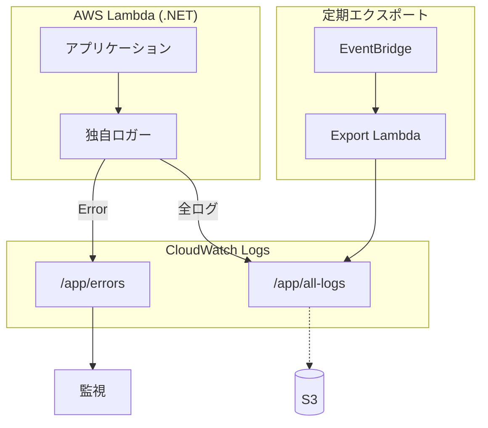
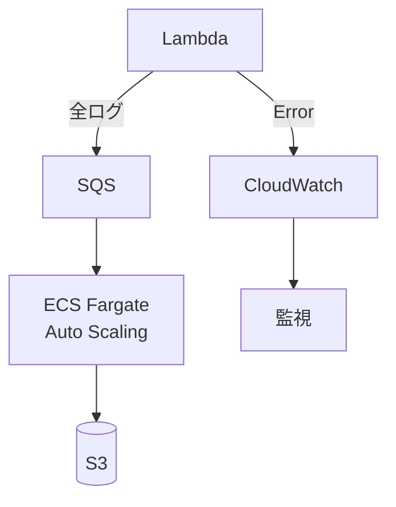
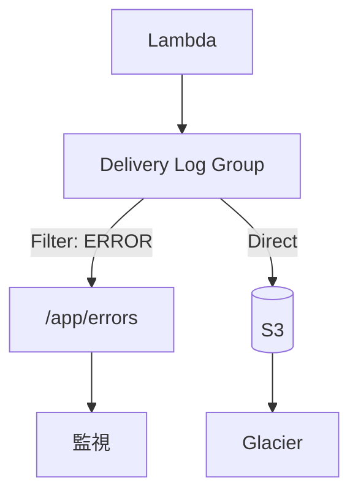
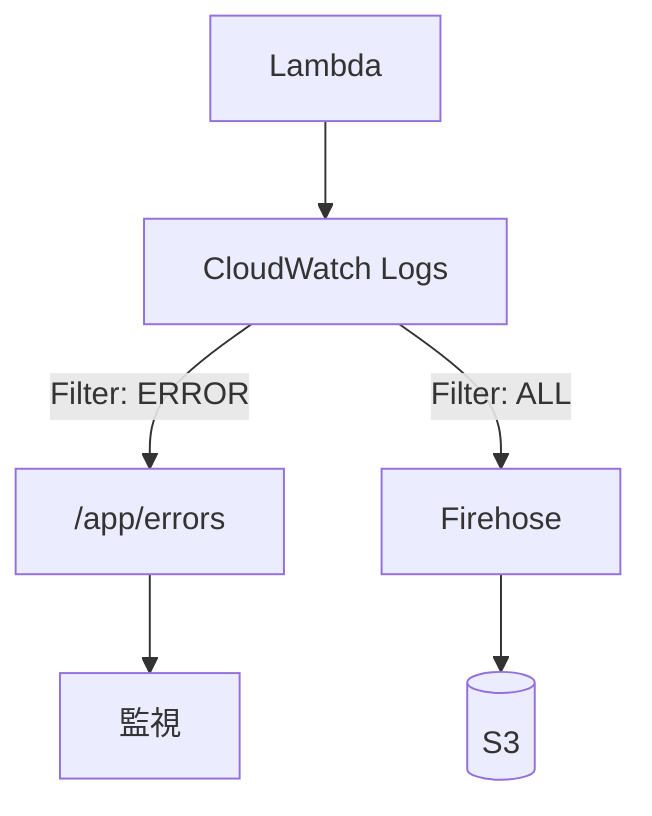
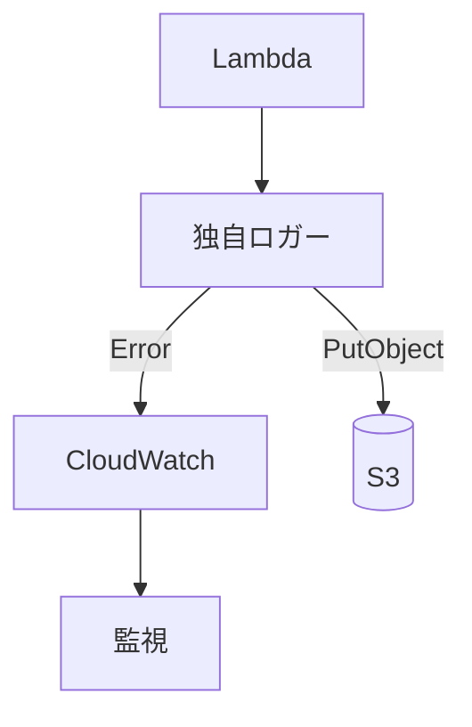

# AWS Lambda(.NET) ロギングアーキテクチャ比較

## 概要

Lambda(.NET)で「異常系ログ→CloudWatch監視、全ログ→S3保存」を実現するアーキテクチャを比較します。

## アーキテクチャ案一覧

| 案 | 構成 | 複雑度 | 推奨ログ量 |
|---|---|---|---|
| **案1** | 独自ロガー + 複数ロググループ | 中 | 〜10GB |
| **案2** | ECS ログ収集サービス | 高 | 50GB〜 |
| **案3** | Lambda直接S3出力（2025年新機能）| 低 | 全範囲 ★推奨 |
| **案4** | Subscription Filter + Firehose | 中 | 10GB〜 |
| **案5** | 独自ロガー + 直接S3書き込み | 低 | 〜1GB |

---

## 案1: 独自ロガー + 複数ロググループ



### Terraform

```hcl
variable "app_name" { default = "my-app" }
variable "lambda_role_arn" { description = "既存Lambda実行ロールARN" }

resource "aws_cloudwatch_log_group" "errors" {
  name              = "/${var.app_name}/errors"
  retention_in_days = 7
}

resource "aws_cloudwatch_log_group" "all_logs" {
  name              = "/${var.app_name}/all-logs"
  retention_in_days = 3
}

resource "aws_s3_bucket" "logs" {
  bucket = "${var.app_name}-logs-archive"
}

resource "aws_s3_bucket_lifecycle_configuration" "logs" {
  bucket = aws_s3_bucket.logs.id
  rule {
    id     = "archive"
    status = "Enabled"
    transition { days = 90; storage_class = "GLACIER" }
    expiration { days = 365 }
  }
}

resource "aws_s3_bucket_policy" "logs" {
  bucket = aws_s3_bucket.logs.id
  policy = jsonencode({
    Version = "2012-10-17"
    Statement = [{
      Effect    = "Allow"
      Principal = { Service = "logs.amazonaws.com" }
      Action    = ["s3:GetBucketAcl", "s3:PutObject"]
      Resource  = [aws_s3_bucket.logs.arn, "${aws_s3_bucket.logs.arn}/*"]
    }]
  })
}

resource "aws_cloudwatch_event_rule" "daily_export" {
  name                = "${var.app_name}-log-export"
  schedule_expression = "cron(0 2 * * ? *)"
}

resource "aws_cloudwatch_log_metric_filter" "errors" {
  name           = "${var.app_name}-error-count"
  pattern        = "?ERROR ?CRITICAL"
  log_group_name = aws_cloudwatch_log_group.errors.name
  metric_transformation {
    name      = "ErrorCount"
    namespace = var.app_name
    value     = "1"
  }
}

resource "aws_cloudwatch_metric_alarm" "errors" {
  alarm_name          = "${var.app_name}-errors"
  comparison_operator = "GreaterThanThreshold"
  evaluation_periods  = 1
  metric_name         = "ErrorCount"
  namespace           = var.app_name
  period              = 300
  statistic           = "Sum"
  threshold           = 10
}
```

### 独自ロガー（C#）

```csharp
using Amazon.CloudWatchLogs;
using Amazon.CloudWatchLogs.Model;
using Microsoft.Extensions.Logging;
using System.Text.Json;

namespace MyApp.Logging;

public class DualLoggerOptions
{
    public string ApplicationName { get; set; } = "my-app";
    public string AllLogsGroupName { get; set; } = "/my-app/all-logs";
    public string ErrorLogsGroupName { get; set; } = "/my-app/errors";
    public LogLevel MinimumErrorLevel { get; set; } = LogLevel.Error;
}

public class DualLogger : ILogger
{
    private readonly IAmazonCloudWatchLogs _client;
    private readonly DualLoggerOptions _options;
    private readonly string _streamName;
    private readonly List<InputLogEvent> _allBuffer = new();
    private readonly List<InputLogEvent> _errorBuffer = new();
    private readonly object _lock = new();

    public DualLogger(IAmazonCloudWatchLogs client, DualLoggerOptions options)
    {
        _client = client;
        _options = options;
        _streamName = $"{DateTime.UtcNow:yyyy/MM/dd}/{Guid.NewGuid():N}";
        InitStreams();
    }

    public void Log<TState>(LogLevel level, EventId eventId, TState state,
        Exception? ex, Func<TState, Exception?, string> formatter)
    {
        if (level == LogLevel.None) return;

        var entry = JsonSerializer.Serialize(new {
            timestamp = DateTime.UtcNow.ToString("o"),
            level = level.ToString(),
            app = _options.ApplicationName,
            message = formatter(state, ex),
            exception = ex?.ToString()
        });

        var evt = new InputLogEvent { Timestamp = DateTime.UtcNow, Message = entry };

        lock (_lock)
        {
            _allBuffer.Add(evt);
            if (level >= _options.MinimumErrorLevel)
            {
                _errorBuffer.Add(evt);
                Console.Error.WriteLine(entry);
            }
        }
    }

    public async Task FlushAsync()
    {
        var tasks = new List<Task>();
        lock (_lock)
        {
            if (_allBuffer.Count > 0)
                tasks.Add(PutLogs(_options.AllLogsGroupName, _allBuffer.ToList()));
            if (_errorBuffer.Count > 0)
                tasks.Add(PutLogs(_options.ErrorLogsGroupName, _errorBuffer.ToList()));
            _allBuffer.Clear();
            _errorBuffer.Clear();
        }
        await Task.WhenAll(tasks);
    }

    private async Task PutLogs(string group, List<InputLogEvent> events) =>
        await _client.PutLogEventsAsync(new PutLogEventsRequest
        {
            LogGroupName = group,
            LogStreamName = _streamName,
            LogEvents = events.OrderBy(e => e.Timestamp).ToList()
        });

    private void InitStreams()
    {
        foreach (var g in new[] { _options.AllLogsGroupName, _options.ErrorLogsGroupName })
            try { _client.CreateLogStreamAsync(new() { LogGroupName = g, LogStreamName = _streamName }).Wait(); }
            catch (ResourceAlreadyExistsException) { }
    }

    public IDisposable? BeginScope<T>(T state) where T : notnull => null;
    public bool IsEnabled(LogLevel level) => level != LogLevel.None;
}
```

**参照ドキュメント**: [CloudWatch Logs Export to S3](https://docs.aws.amazon.com/AmazonCloudWatch/latest/logs/S3ExportTasksConsole.html)

---

## 案2: ECSログ収集サービス



### Terraform

```hcl
variable "app_name" { default = "my-app" }
variable "vpc_id" { description = "既存VPC ID" }
variable "private_subnet_ids" { type = list(string) }
variable "ecs_task_role_arn" {}
variable "ecs_execution_role_arn" {}

resource "aws_sqs_queue" "logs" {
  name                       = "${var.app_name}-logs"
  visibility_timeout_seconds = 300
}

resource "aws_s3_bucket" "logs" {
  bucket = "${var.app_name}-logs"
}

resource "aws_cloudwatch_log_group" "errors" {
  name              = "/${var.app_name}/errors"
  retention_in_days = 7
}

resource "aws_ecs_cluster" "logs" {
  name = "${var.app_name}-log-collector"
}

resource "aws_ecs_task_definition" "collector" {
  family                   = "${var.app_name}-collector"
  network_mode             = "awsvpc"
  requires_compatibilities = ["FARGATE"]
  cpu                      = "256"
  memory                   = "512"
  execution_role_arn       = var.ecs_execution_role_arn
  task_role_arn            = var.ecs_task_role_arn

  container_definitions = jsonencode([{
    name  = "collector"
    image = "your-ecr-repo/log-collector:latest"
    environment = [
      { name = "SQS_QUEUE_URL", value = aws_sqs_queue.logs.url },
      { name = "S3_BUCKET", value = aws_s3_bucket.logs.id }
    ]
  }])
}

resource "aws_ecs_service" "collector" {
  name            = "${var.app_name}-collector"
  cluster         = aws_ecs_cluster.logs.id
  task_definition = aws_ecs_task_definition.collector.arn
  desired_count   = 1
  launch_type     = "FARGATE"

  network_configuration {
    subnets         = var.private_subnet_ids
    security_groups = [aws_security_group.ecs.id]
  }
}

resource "aws_security_group" "ecs" {
  name   = "${var.app_name}-ecs"
  vpc_id = var.vpc_id
  egress { from_port = 0; to_port = 0; protocol = "-1"; cidr_blocks = ["0.0.0.0/0"] }
}

resource "aws_appautoscaling_target" "ecs" {
  max_capacity       = 10
  min_capacity       = 1
  resource_id        = "service/${aws_ecs_cluster.logs.name}/${aws_ecs_service.collector.name}"
  scalable_dimension = "ecs:service:DesiredCount"
  service_namespace  = "ecs"
}
```

### SQS送信ロガー（C#）

```csharp
using Amazon.SQS;
using Amazon.SQS.Model;
using Microsoft.Extensions.Logging;
using System.Text.Json;

public class SqsLogger : ILogger
{
    private readonly IAmazonSQS _sqs;
    private readonly string _queueUrl;
    private readonly string _appName;
    private readonly List<SendMessageBatchRequestEntry> _buffer = new();
    private readonly object _lock = new();

    public SqsLogger(IAmazonSQS sqs, string queueUrl, string appName)
    {
        _sqs = sqs; _queueUrl = queueUrl; _appName = appName;
    }

    public void Log<TState>(LogLevel level, EventId id, TState state,
        Exception? ex, Func<TState, Exception?, string> fmt)
    {
        var msg = JsonSerializer.Serialize(new {
            timestamp = DateTime.UtcNow.ToString("o"),
            level = level.ToString(),
            app = _appName,
            message = fmt(state, ex),
            exception = ex?.ToString()
        });

        if (level >= LogLevel.Error) Console.Error.WriteLine(msg);

        lock (_lock)
        {
            _buffer.Add(new() { Id = Guid.NewGuid().ToString("N"), MessageBody = msg });
            if (_buffer.Count >= 10) FlushAsync().Wait();
        }
    }

    public async Task FlushAsync()
    {
        List<SendMessageBatchRequestEntry> batch;
        lock (_lock) { batch = _buffer.ToList(); _buffer.Clear(); }
        
        foreach (var chunk in batch.Chunk(10))
            await _sqs.SendMessageBatchAsync(new() { QueueUrl = _queueUrl, Entries = chunk.ToList() });
    }

    public IDisposable? BeginScope<T>(T s) where T : notnull => null;
    public bool IsEnabled(LogLevel l) => l != LogLevel.None;
}
```

**参照ドキュメント**: [ECS Fargate](https://docs.aws.amazon.com/AmazonECS/latest/developerguide/AWS_Fargate.html)

---

## 案3: Lambda直接S3出力 ★推奨



### Terraform

```hcl
variable "app_name" { default = "my-app" }
variable "lambda_role_arn" {}

resource "aws_s3_bucket" "logs" {
  bucket = "${var.app_name}-logs"
}

resource "aws_s3_bucket_lifecycle_configuration" "logs" {
  bucket = aws_s3_bucket.logs.id
  rule {
    id     = "archive"
    status = "Enabled"
    transition { days = 90; storage_class = "GLACIER" }
    expiration { days = 365 }
  }
}

resource "aws_s3_bucket_policy" "logs" {
  bucket = aws_s3_bucket.logs.id
  policy = jsonencode({
    Version = "2012-10-17"
    Statement = [{
      Effect    = "Allow"
      Principal = { Service = "logs.amazonaws.com" }
      Action    = ["s3:PutObject", "s3:GetBucketAcl"]
      Resource  = [aws_s3_bucket.logs.arn, "${aws_s3_bucket.logs.arn}/*"]
    }]
  })
}

resource "aws_cloudwatch_log_group" "errors" {
  name              = "/${var.app_name}/errors"
  retention_in_days = 7
}

resource "aws_cloudwatch_log_group" "delivery" {
  name              = "/${var.app_name}/delivery"
  retention_in_days = 1
}

resource "aws_iam_role" "cwl_to_s3" {
  name = "${var.app_name}-cwl-to-s3"
  assume_role_policy = jsonencode({
    Version = "2012-10-17"
    Statement = [{
      Effect    = "Allow"
      Principal = { Service = "logs.amazonaws.com" }
      Action    = "sts:AssumeRole"
    }]
  })
}

resource "aws_iam_role_policy" "cwl_to_s3" {
  name = "${var.app_name}-cwl-to-s3"
  role = aws_iam_role.cwl_to_s3.id
  policy = jsonencode({
    Version = "2012-10-17"
    Statement = [{
      Effect   = "Allow"
      Action   = ["s3:PutObject", "logs:PutLogEvents"]
      Resource = "*"
    }]
  })
}

resource "aws_cloudwatch_log_subscription_filter" "errors" {
  name            = "${var.app_name}-errors"
  log_group_name  = aws_cloudwatch_log_group.delivery.name
  filter_pattern  = "?ERROR ?CRITICAL ?Exception"
  destination_arn = aws_cloudwatch_log_group.errors.arn
  role_arn        = aws_iam_role.cwl_to_s3.arn
}

resource "aws_cloudwatch_metric_alarm" "errors" {
  alarm_name          = "${var.app_name}-errors"
  comparison_operator = "GreaterThanThreshold"
  evaluation_periods  = 1
  metric_name         = "ErrorCount"
  namespace           = var.app_name
  period              = 300
  statistic           = "Sum"
  threshold           = 10
}

resource "aws_lambda_function" "app" {
  function_name = var.app_name
  runtime       = "dotnet8"
  handler       = "MyApp::MyApp.Function::Handler"
  role          = var.lambda_role_arn
  filename      = "app.zip"

  logging_config {
    log_format = "JSON"
    log_group  = aws_cloudwatch_log_group.delivery.name
  }
}
```

**参照ドキュメント**: [Lambda logs to S3](https://docs.aws.amazon.com/lambda/latest/dg/logging-with-s3.html)

---

## 案4: Subscription Filter + Firehose



### Terraform

```hcl
variable "app_name" { default = "my-app" }
variable "lambda_role_arn" {}

resource "aws_s3_bucket" "logs" { bucket = "${var.app_name}-logs" }

resource "aws_cloudwatch_log_group" "lambda" {
  name              = "/aws/lambda/${var.app_name}"
  retention_in_days = 3
}

resource "aws_kinesis_firehose_delivery_stream" "logs" {
  name        = "${var.app_name}-logs"
  destination = "extended_s3"

  extended_s3_configuration {
    role_arn           = aws_iam_role.firehose.arn
    bucket_arn         = aws_s3_bucket.logs.arn
    prefix             = "logs/${var.app_name}/year=!{timestamp:yyyy}/month=!{timestamp:MM}/day=!{timestamp:dd}/"
    buffering_size     = 5
    buffering_interval = 300
    compression_format = "GZIP"
  }
}

resource "aws_iam_role" "firehose" {
  name = "${var.app_name}-firehose"
  assume_role_policy = jsonencode({
    Version = "2012-10-17"
    Statement = [{
      Effect    = "Allow"
      Principal = { Service = "firehose.amazonaws.com" }
      Action    = "sts:AssumeRole"
    }]
  })
}

resource "aws_iam_role_policy" "firehose" {
  name = "${var.app_name}-firehose"
  role = aws_iam_role.firehose.id
  policy = jsonencode({
    Version = "2012-10-17"
    Statement = [{
      Effect   = "Allow"
      Action   = ["s3:PutObject", "s3:GetBucketLocation"]
      Resource = ["${aws_s3_bucket.logs.arn}/*"]
    }]
  })
}

resource "aws_iam_role" "cwl_to_firehose" {
  name = "${var.app_name}-cwl-firehose"
  assume_role_policy = jsonencode({
    Version = "2012-10-17"
    Statement = [{
      Effect    = "Allow"
      Principal = { Service = "logs.amazonaws.com" }
      Action    = "sts:AssumeRole"
    }]
  })
}

resource "aws_iam_role_policy" "cwl_to_firehose" {
  name = "${var.app_name}-cwl-firehose"
  role = aws_iam_role.cwl_to_firehose.id
  policy = jsonencode({
    Version = "2012-10-17"
    Statement = [{
      Effect   = "Allow"
      Action   = ["firehose:PutRecord", "firehose:PutRecordBatch"]
      Resource = aws_kinesis_firehose_delivery_stream.logs.arn
    }]
  })
}

resource "aws_cloudwatch_log_subscription_filter" "all" {
  name            = "${var.app_name}-all"
  log_group_name  = aws_cloudwatch_log_group.lambda.name
  filter_pattern  = ""
  destination_arn = aws_kinesis_firehose_delivery_stream.logs.arn
  role_arn        = aws_iam_role.cwl_to_firehose.arn
}
```

**参照ドキュメント**: [Subscription filters with Firehose](https://docs.aws.amazon.com/AmazonCloudWatch/latest/logs/SubscriptionFilters.html)

---

## 案5: 直接S3書き込み



### Terraform

```hcl
variable "app_name" { default = "my-app" }
variable "lambda_role_arn" {}

resource "aws_s3_bucket" "logs" { bucket = "${var.app_name}-logs" }

resource "aws_s3_bucket_lifecycle_configuration" "logs" {
  bucket = aws_s3_bucket.logs.id
  rule {
    id     = "archive"
    status = "Enabled"
    transition { days = 90; storage_class = "GLACIER" }
  }
}

resource "aws_cloudwatch_log_group" "errors" {
  name              = "/${var.app_name}/errors"
  retention_in_days = 7
}

resource "aws_iam_role_policy" "lambda_s3" {
  name = "${var.app_name}-s3"
  role = split("/", var.lambda_role_arn)[1]
  policy = jsonencode({
    Version = "2012-10-17"
    Statement = [{
      Effect   = "Allow"
      Action   = ["s3:PutObject"]
      Resource = "${aws_s3_bucket.logs.arn}/*"
    }]
  })
}
```

### S3直接ロガー（C#）

```csharp
using Amazon.S3;
using Amazon.S3.Model;
using Microsoft.Extensions.Logging;
using System.IO.Compression;
using System.Text;
using System.Text.Json;

public class S3Logger : ILogger
{
    private readonly IAmazonS3 _s3;
    private readonly string _bucket;
    private readonly string _appName;
    private readonly StringBuilder _buffer = new();
    private readonly string _reqId = Guid.NewGuid().ToString("N")[..8];

    public S3Logger(IAmazonS3 s3, string bucket, string appName)
    {
        _s3 = s3; _bucket = bucket; _appName = appName;
    }

    public void Log<TState>(LogLevel level, EventId id, TState state,
        Exception? ex, Func<TState, Exception?, string> fmt)
    {
        var msg = JsonSerializer.Serialize(new {
            timestamp = DateTime.UtcNow.ToString("o"),
            level = level.ToString(),
            app = _appName,
            message = fmt(state, ex),
            exception = ex?.ToString()
        });

        lock (_buffer) { _buffer.AppendLine(msg); }
        if (level >= LogLevel.Error) Console.Error.WriteLine(msg);
    }

    public async Task FlushAsync()
    {
        string content;
        lock (_buffer) { content = _buffer.ToString(); _buffer.Clear(); }
        if (string.IsNullOrEmpty(content)) return;

        var now = DateTime.UtcNow;
        var key = $"logs/{_appName}/year={now:yyyy}/month={now:MM}/day={now:dd}/{now:HHmmss}-{_reqId}.log.gz";

        using var ms = new MemoryStream();
        using (var gz = new GZipStream(ms, CompressionMode.Compress))
            await gz.WriteAsync(Encoding.UTF8.GetBytes(content));

        await _s3.PutObjectAsync(new PutObjectRequest
        {
            BucketName = _bucket,
            Key = key,
            InputStream = new MemoryStream(ms.ToArray())
        });
    }

    public IDisposable? BeginScope<T>(T s) where T : notnull => null;
    public bool IsEnabled(LogLevel l) => l != LogLevel.None;
}
```

**参照ドキュメント**: [S3 PutObject](https://docs.aws.amazon.com/sdkfornet/v3/apidocs/items/S3/MPutObjectAsyncPutObjectRequestCancellationToken.html)

---

## 費用比較（月額・東京リージョン）

### 料金単価

| サービス | 項目 | 単価 |
|---|---|---|
| CloudWatch Logs | 取り込み | $0.50/GB |
| Lambda S3直接出力 | 配信 | $0.25/GB |
| Kinesis Firehose | 取り込み | $0.029/GB |
| S3 Standard | ストレージ | $0.025/GB/月 |
| ECS Fargate | vCPU | $0.04/時間 |

### 月間費用比較

| ログ量 | 案1 | 案2 | 案3 ★ | 案4 | 案5 |
|---:|---:|---:|---:|---:|---:|
| 100MB | $0.11 | $15〜 | **$0.05** | $0.09 | $0.04 |
| 1GB | $1.05 | $15〜 | **$0.50** | $0.84 | $0.30 |
| 10GB | $10.30 | $25〜 | **$5.00** | $8.20 | $2.80 |
| 50GB | $51.50 | $50〜 | **$18.75** | $36.00 | $12.50 |
| 100GB | $102.50 | $82〜 | **$37.50** | $67.00 | $15.00 |

---

## まとめ

| ログ量 | 推奨案 | 月額目安 |
|---|---|---|
| 〜1GB | 案3 or 案5 | $0.30〜$0.50 |
| 1〜50GB | **案3** ★ | $0.50〜$25 |
| 50GB〜 | 案3 or 案2 | $25〜 |

**2025年5月以降は「案3: Lambda直接S3出力」が最も推奨**。AWSマネージドでインフラ管理不要、コスト効率良好。
