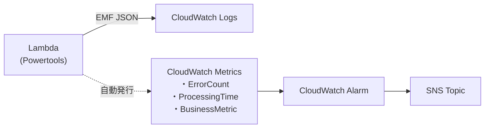
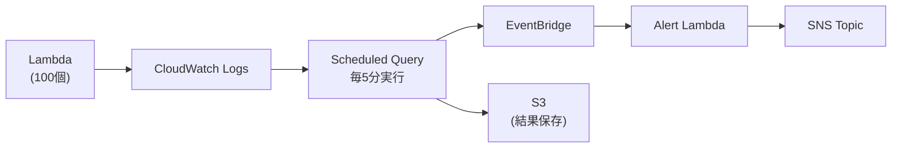
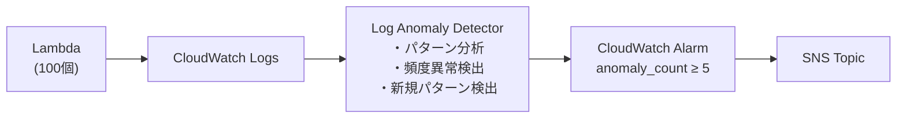
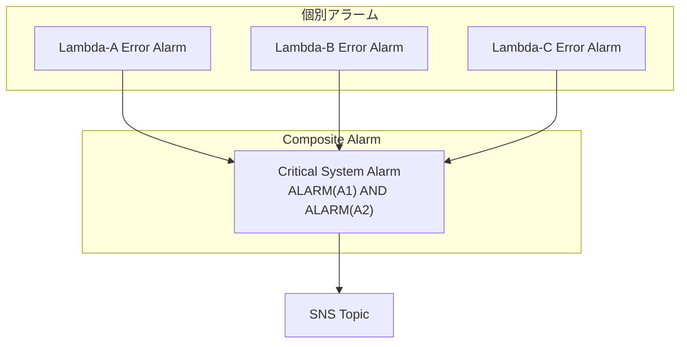
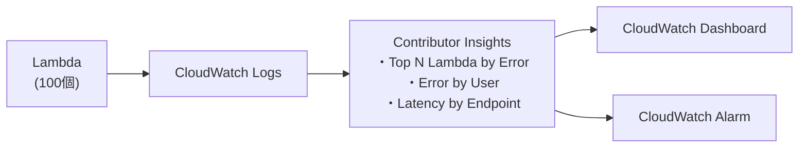
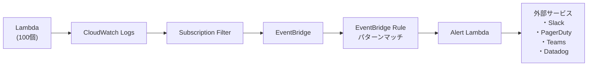
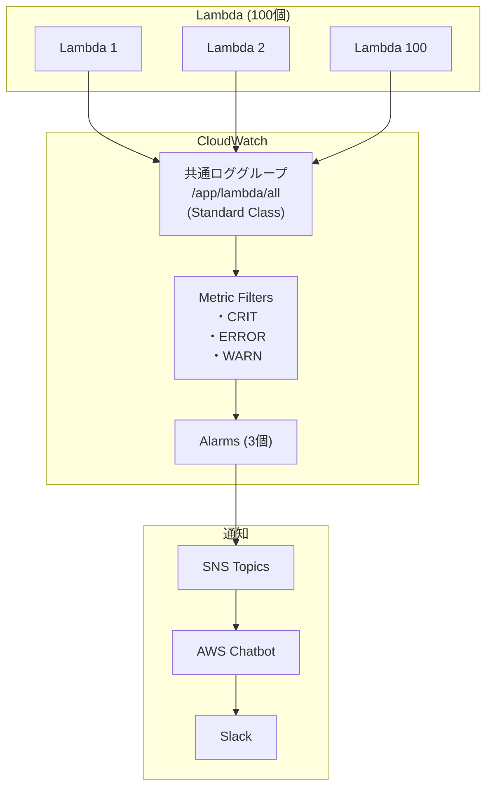

# 複数 Lambda のログ監視・アラーム方法調査

## 概要

複数の Lambda 関数のログを監視し、異常を検知してアラートを発報する方法を整理する。

### 前提条件

| 項目 | 値 |
|------|-----|
| Lambda関数数 | 100個 |
| ランタイム | .NET 8 (C#) |
| アラート要件 | CRIT/ERROR: 即時、WARN: 頻度ベース |

---

## アラーム方法一覧

| # | 方法 | コスト | 複雑度 | リアルタイム性 | 推奨度 |
|---|------|-------|-------|--------------|--------|
| 1 | Metric Filter + Alarm | 低 | ★☆☆ | ◎ 1分以内 | ◎ |
| 2 | Embedded Metrics Format (EMF) | 低 | ★☆☆ | ◎ 1分以内 | ◎ |
| 3 | Subscription Filter + Lambda | 中 | ★★☆ | ◎ 数秒 | ○ |
| 4 | Logs Insights Scheduled Query | 低 | ★★☆ | △ 分単位 | ○ |
| 5 | Log Anomaly Detection | 低 | ★☆☆ | ○ 数分 | ○ |
| 6 | Composite Alarm | 低 | ★★☆ | ◎ 1分以内 | ◎ |
| 7 | Contributor Insights | 中 | ★★☆ | ○ 数分 | △ |
| 8 | EventBridge + Lambda | 中 | ★★★ | ◎ 数秒 | △ |

---

## 方法1: Metric Filter + CloudWatch Alarm（推奨）

### 概要

ログイベントからパターンマッチでメトリクスを抽出し、閾値超過時にアラームを発報する**最も基本的な方法**。

### 構成図

```mermaid
flowchart LR
    Lambda["Lambda<br/>(100個)"] --> LG["CloudWatch Logs<br/>(Standard Class)"]
    LG --> MF["Metric Filter<br/>・CRIT: { $.level = \"Critical\" }<br/>・ERROR: { $.level = \"Error\" }<br/>・WARN: { $.level = \"Warning\" }"]
    MF --> Metric["CloudWatch Metrics<br/>・CriticalCount<br/>・ErrorCount<br/>・WarnCount"]
    Metric --> Alarm["CloudWatch Alarm<br/>・CRIT: ≥1/1min<br/>・ERROR: ≥1/1min<br/>・WARN: ≥10/5min"]
    Alarm --> SNS["SNS Topic"]
    SNS --> Email["Email"]
    SNS --> Slack["Slack/Teams"]
    SNS --> PD["PagerDuty"]
```

### 特徴

| メリット | デメリット |
|---------|-----------|
| 設定がシンプル | Standard クラスのみ対応 |
| 追加コストが低い | 正規表現は5パターンまで |
| リアルタイム性が高い | ロググループ毎に設定必要 |
| Terraform/CloudFormation対応 | 複雑なパターンは困難 |

### コスト（100個Lambda、6GB ERROR/WARN/月）

| 項目 | 計算 | 費用/月 |
|------|------|--------|
| Metric Filter | 無料 | $0 |
| CloudWatch Alarm (3個) | 3 × $0.10 | $0.30 |
| SNS通知 | 1000件 × $0.00002 | $0.02 |
| **合計** | | **~$0.32** |

※ CloudWatch Logs 取り込み費用は別途

### 関連ドキュメント

| トピック | URL |
|---------|-----|
| Metric Filter 概要 | https://docs.aws.amazon.com/AmazonCloudWatch/latest/logs/MonitoringLogData.html |
| Filter パターン構文 | https://docs.aws.amazon.com/AmazonCloudWatch/latest/logs/FilterAndPatternSyntaxForMetricFilters.html |
| Metric Filter 作成手順 | https://docs.aws.amazon.com/AmazonCloudWatch/latest/logs/CreateMetricFilterProcedure.html |
| Metric Filter 例 | https://docs.aws.amazon.com/AmazonCloudWatch/latest/logs/MonitoringPolicyExamples.html |
| PutMetricFilter API | https://docs.aws.amazon.com/AmazonCloudWatchLogs/latest/APIReference/API_PutMetricFilter.html |
| ログベースアラーム作成 | https://docs.aws.amazon.com/AmazonCloudWatch/latest/monitoring/Alarm-On-Logs.html |
| CloudWatch Alarm 概要 | https://docs.aws.amazon.com/AmazonCloudWatch/latest/monitoring/AlarmThatSendsEmail.html |
| SNS 通知設定 | https://docs.aws.amazon.com/AmazonCloudWatch/latest/monitoring/Notify_Users_Alarm_Changes.html |

---

## 方法2: Embedded Metrics Format (EMF)（推奨）

### 概要

アプリケーションコード内でメトリクスを定義し、ログ出力と同時に CloudWatch Metrics に発行する方法。
**Powertools for AWS Lambda** を使用すると簡単に実装可能。

### 構成図



### 特徴

| メリット | デメリット |
|---------|-----------|
| 柔軟なメトリクス定義 | アプリ修正が必要 |
| ディメンション追加が容易 | Powertools 依存 |
| ログとメトリクスが統合 | EMF仕様の理解が必要 |
| 高カーディナリティ対応 | |

### C# 実装例

```csharp
using AWS.Lambda.Powertools.Metrics;

[Metrics(Namespace = "MyApp/Lambda", Service = "OrderService")]
public class Function
{
    private readonly IMetrics _metrics;

    [LambdaFunction]
    [Logging]
    [Metrics(CaptureColdStart = true)]
    public async Task<string> Handler(OrderRequest request, ILambdaContext context)
    {
        try
        {
            // ビジネスメトリクス
            Metrics.AddMetric("OrderProcessed", 1, MetricUnit.Count);
            Metrics.AddDimension("OrderType", request.Type);
            
            var result = await ProcessOrder(request);
            return result;
        }
        catch (Exception ex)
        {
            // エラーメトリクス（これがAlarmのトリガーになる）
            Metrics.AddMetric("ErrorCount", 1, MetricUnit.Count);
            Metrics.AddDimension("ErrorType", ex.GetType().Name);
            throw;
        }
    }
}
```

### コスト

| 項目 | 計算 | 費用/月 |
|------|------|--------|
| CloudWatch カスタムメトリクス | 10個 × $0.30 | $3.00 |
| CloudWatch Alarm (3個) | 3 × $0.10 | $0.30 |
| **合計** | | **~$3.30** |

### 関連ドキュメント

| トピック | URL |
|---------|-----|
| Powertools for .NET - Metrics | https://docs.aws.amazon.com/powertools/dotnet/core/logging/index.html |
| Powertools Metrics API (.NET) | https://docs.aws.amazon.com/powertools/dotnet/api/api/AWS.Lambda.Powertools.Metrics.html |
| EMF 仕様 | https://docs.aws.amazon.com/AmazonCloudWatch/latest/monitoring/CloudWatch_Embedded_Metric_Format_Specification.html |
| Lambda JSON ログ形式 | https://docs.aws.amazon.com/lambda/latest/dg/monitoring-cloudwatchlogs-logformat.html |
| Powertools for .NET - Logging | https://docs.aws.amazon.com/powertools/dotnet/getting-started/logger/simple/index.html |
| Powertools Logging V2 | https://docs.aws.amazon.com/powertools/dotnet/core/logging-v2/index.html |

---

## 方法3: Subscription Filter + Lambda

### 概要

ログイベントをリアルタイムで Lambda 関数に転送し、カスタムロジックでアラートを発報する方法。
複雑なフィルタリングや外部サービス連携に適している。

### 構成図

```mermaid
flowchart LR
    Lambda["Lambda<br/>(100個)"] --> LG["CloudWatch Logs"]
    LG --> SF["Subscription Filter<br/>{ $.level IN [\"Error\", \"Critical\"] }"]
    SF --> AlertLambda["Alert Lambda<br/>・パース<br/>・判定<br/>・通知"]
    AlertLambda --> Slack["Slack API"]
    AlertLambda --> PD["PagerDuty API"]
    AlertLambda --> SNS["SNS Topic"]
```

### 特徴

| メリット | デメリット |
|---------|-----------|
| 完全なカスタマイズ | Lambda 実装・運用コスト |
| 外部API直接連携 | Subscription Filter は Standard のみ |
| 複雑な条件分岐 | 追加の Lambda コスト |
| エンリッチメント可能 | |

### コスト（月1000件アラート）

| 項目 | 計算 | 費用/月 |
|------|------|--------|
| Alert Lambda | 1000回 × 128MB × 0.5秒 | ~$0.01 |
| SNS通知 | 1000件 × $0.00002 | $0.02 |
| **合計** | | **~$0.03** |

### 関連ドキュメント

| トピック | URL |
|---------|-----|
| Subscription Filter 概要 | https://docs.aws.amazon.com/AmazonCloudWatch/latest/logs/Subscriptions.html |
| ロググループレベル Subscription | https://docs.aws.amazon.com/AmazonCloudWatch/latest/logs/SubscriptionFilters.html |
| アカウントレベル Subscription | https://docs.aws.amazon.com/AmazonCloudWatch/latest/logs/SubscriptionFilters-AccountLevel.html |
| Subscription Filter 概念 | https://docs.aws.amazon.com/AmazonCloudWatch/latest/logs/subscription-concepts.html |
| PutSubscriptionFilter API | https://docs.aws.amazon.com/AmazonCloudWatchLogs/latest/APIReference/API_PutSubscriptionFilter.html |
| Lambda と SNS の連携 | https://docs.aws.amazon.com/lambda/latest/dg/with-sns.html |

---

## 方法4: Logs Insights Scheduled Query

### 概要

CloudWatch Logs Insights のクエリを定期実行し、結果を EventBridge に送信してアラートをトリガーする方法。
**2025年11月にリリースされた新機能**。

### 構成図



### クエリ例

```sql
fields @timestamp, @message, level, function_name
| filter level in ["Error", "Critical", "Warning"]
| stats count(*) as error_count by function_name, level
| filter error_count >= 10
| sort error_count desc
```

### 特徴

| メリット | デメリット |
|---------|-----------|
| 複雑な集計クエリ | リアルタイム性なし（分単位） |
| 複数ロググループ横断 | 新機能（2025年11月〜） |
| S3 への結果保存 | 同時30クエリまで |
| コスト効率が良い | |

### コスト

| 項目 | 計算 | 費用/月 |
|------|------|--------|
| Logs Insights クエリ | 100GB × $0.0063 × 288回 | ~$18.14 |
| S3 保存 | 1GB × $0.025 | $0.03 |
| **合計** | | **~$18.17** |

### 関連ドキュメント

| トピック | URL |
|---------|-----|
| Scheduled Query 概要 | https://docs.aws.amazon.com/AmazonCloudWatch/latest/logs/ScheduledQueries.html |
| Scheduled Query 作成 | https://docs.aws.amazon.com/AmazonCloudWatch/latest/logs/create-scheduled-query.html |
| Scheduled Query 入門 | https://docs.aws.amazon.com/AmazonCloudWatch/latest/logs/scheduled-queries-getting-started.html |
| CreateScheduledQuery API | https://docs.aws.amazon.com/AmazonCloudWatchLogs/latest/APIReference/API_CreateScheduledQuery.html |
| トラブルシューティング | https://docs.aws.amazon.com/AmazonCloudWatch/latest/logs/scheduled-queries-troubleshooting.html |
| Logs Insights クエリ構文 | https://docs.aws.amazon.com/AmazonCloudWatch/latest/logs/CWL_QuerySyntax.html |

---

## 方法5: Log Anomaly Detection

### 概要

機械学習を使用してログパターンの異常を自動検出し、アラートを発報する方法。
閾値設定不要で未知の異常を検出可能。

### 構成図



### 特徴

| メリット | デメリット |
|---------|-----------|
| 閾値設定不要 | 学習期間が必要（数日） |
| 未知の異常を検出 | 誤検知の可能性 |
| パターン変化を追跡 | Standard クラスのみ |
| 5種類の異常タイプ | |

### 検出される異常タイプ

1. **パターン頻度の変化** - 通常より多い/少ないログパターン
2. **新規パターン** - 過去に見られなかったログパターン
3. **トークンの変化** - ログ内の値の異常な変化
4. **キーワード異常** - 特定キーワードの出現頻度変化
5. **数値異常** - 数値フィールドの異常値

### コスト

| 項目 | 計算 | 費用/月 |
|------|------|--------|
| Log Anomaly Detection | 100GB × $0.05 | $5.00 |
| CloudWatch Alarm | 1 × $0.10 | $0.10 |
| **合計** | | **~$5.10** |

### 関連ドキュメント

| トピック | URL |
|---------|-----|
| Log Anomaly Detection 概要 | https://docs.aws.amazon.com/AmazonCloudWatch/latest/logs/LogsAnomalyDetection.html |
| Anomaly Detector でアラーム作成 | https://docs.aws.amazon.com/AmazonCloudWatch/latest/logs/LogsAnomalyDetection-Alarms.html |
| Logs Insights での異常検出 | https://docs.aws.amazon.com/AmazonCloudWatch/latest/logs/LogsAnomalyDetection-Insights.html |
| メトリクスの異常検出 | https://docs.aws.amazon.com/AmazonCloudWatch/latest/monitoring/CloudWatch_Anomaly_Detection.html |
| 異常検出アラーム作成ガイド | https://docs.aws.amazon.com/prescriptive-guidance/latest/patterns/create-alarms-for-custom-metrics-using-amazon-cloudwatch-anomaly-detection.html |

---

## 方法6: Composite Alarm

### 概要

複数のアラームを組み合わせて、より複雑な条件でアラートを発報する方法。
例：「Lambda A と Lambda B の両方でエラーが発生した場合のみ通知」

### 構成図



### 特徴

| メリット | デメリット |
|---------|-----------|
| 複雑な条件を表現 | 個別アラームが前提 |
| アラームノイズ削減 | 設定が複雑になりがち |
| 依存関係を表現可能 | |
| アクション抑制機能 | |

### ルール式の例

```
# A と B の両方がアラーム状態
ALARM(Lambda-A-Error) AND ALARM(Lambda-B-Error)

# A または B がアラーム状態
ALARM(Lambda-A-Error) OR ALARM(Lambda-B-Error)

# A がアラームで B は正常
ALARM(Lambda-A-Error) AND NOT ALARM(Lambda-B-Error)

# 3つ中2つ以上がアラーム
ALARM(Lambda-A-Error) AND ALARM(Lambda-B-Error) OR 
ALARM(Lambda-A-Error) AND ALARM(Lambda-C-Error) OR
ALARM(Lambda-B-Error) AND ALARM(Lambda-C-Error)
```

### コスト

| 項目 | 計算 | 費用/月 |
|------|------|--------|
| 個別アラーム (100個) | 100 × $0.10 | $10.00 |
| Composite Alarm (10個) | 10 × $0.50 | $5.00 |
| **合計** | | **~$15.00** |

### 関連ドキュメント

| トピック | URL |
|---------|-----|
| Composite Alarm 概要 | https://docs.aws.amazon.com/AmazonCloudWatch/latest/monitoring/Create_Composite_Alarm.html |
| Composite Alarm 作成手順 | https://docs.aws.amazon.com/AmazonCloudWatch/latest/monitoring/Create_Composite_Alarm_How_To.html |
| アクション抑制 | https://docs.aws.amazon.com/AmazonCloudWatch/latest/monitoring/Create_Composite_Alarm_Suppression.html |
| PutCompositeAlarm CLI | https://docs.aws.amazon.com/cli/v1/reference/cloudwatch/put-composite-alarm.html |
| Multi-AZ での活用 | https://docs.aws.amazon.com/whitepapers/latest/advanced-multi-az-resilience-patterns/failure-detection-with-cloudwatch-composite-alarms.html |

---

## 方法7: Contributor Insights

### 概要

ログデータからトップコントリビューター（最も多くのエラーを出す Lambda など）を特定する方法。

### 構成図



### 特徴

| メリット | デメリット |
|---------|-----------|
| トップN分析 | Standard クラスのみ |
| リアルタイム可視化 | 設定が複雑 |
| トレンド分析 | 追加コスト |

### コスト

| 項目 | 計算 | 費用/月 |
|------|------|--------|
| Contributor Insights ルール | 5個 × $0.02/100万イベント | ~$10.00 |
| **合計** | | **~$10.00** |

### 関連ドキュメント

| トピック | URL |
|---------|-----|
| Contributor Insights ルール作成 | https://docs.aws.amazon.com/AmazonCloudWatch/latest/monitoring/ContributorInsights-CreateRule.html |
| CloudWatch Logs 分析 | https://docs.aws.amazon.com/AmazonCloudWatch/latest/logs/AnalyzingLogData.html |

---

## 方法8: EventBridge + カスタム Lambda

### 概要

CloudWatch Logs を EventBridge 経由で Lambda に転送し、完全にカスタムなアラートロジックを実装する方法。

### 構成図



### 特徴

| メリット | デメリット |
|---------|-----------|
| 完全なカスタマイズ | 実装コスト高 |
| 任意の外部連携 | 運用負荷 |
| イベント駆動 | |

### 関連ドキュメント

| トピック | URL |
|---------|-----|
| EventBridge ログ記録 | https://aws.amazon.com/blogs/aws/monitor-and-debug-event-driven-applications-with-new-amazon-eventbridge-logging/ |
| Lambda と SNS 連携 | https://docs.aws.amazon.com/lambda/latest/dg/with-sns.html |
| PagerDuty 連携 | https://docs.aws.amazon.com/incident-manager/latest/userguide/migration-pagerduty.html |

---

## 通知先の設定

### SNS Topic からの通知先

| 通知先 | 設定方法 | 関連ドキュメント |
|--------|---------|----------------|
| **Email** | SNS Email Subscription | https://docs.aws.amazon.com/sns/latest/dg/sns-email-notifications.html |
| **Slack** | AWS Chatbot or Lambda | https://docs.aws.amazon.com/chatbot/latest/adminguide/slack-setup.html |
| **Microsoft Teams** | AWS Chatbot | https://docs.aws.amazon.com/chatbot/latest/adminguide/teams-setup.html |
| **PagerDuty** | SNS → PagerDuty Integration | https://docs.aws.amazon.com/incident-manager/latest/userguide/migration-pagerduty.html |
| **Lambda** | SNS → Lambda Subscription | https://docs.aws.amazon.com/lambda/latest/dg/with-sns.html |
| **SQS** | SNS → SQS Subscription | https://docs.aws.amazon.com/sns/latest/dg/sns-sqs-as-subscriber.html |

---

## ロググループ構成パターン

### パターン A: 単一ロググループ（推奨）

```
/app/lambda/all  ← 全100個のLambdaが出力
    └── Metric Filter × 3 (CRIT, ERROR, WARN)
        └── Alarm × 3
```

**メリット**: 設定が最小、Alarm も3個のみ

### パターン B: アプリ別ロググループ

```
/app/lambda/app001
/app/lambda/app002
...
/app/lambda/app100
    └── 各 Metric Filter × 3
        └── 各 Alarm × 3
```

**デメリット**: Alarm 300個必要（高コスト）

### パターン C: ハイブリッド（アプリ別 + 集約）

```
/app/lambda/app001 (Delivery Class) → S3
/app/lambda/app002 (Delivery Class) → S3
...
/app/lambda/errors (Standard Class) ← 全アプリの ERROR/WARN を集約
    └── Metric Filter × 3
        └── Alarm × 3
```

**メリット**: アプリ別ログ保存 + 低コストアラーム

---

## 推奨構成

### シンプル構成（推奨）



### 月額コスト（100Lambda、100GB/月、6GB ERROR/WARN）

| 項目 | 費用/月 |
|------|--------|
| CloudWatch Logs 取り込み (6GB Standard) | $3.00 |
| CloudWatch Logs 保存 (7日) | $0.05 |
| CloudWatch Alarm (3個) | $0.30 |
| SNS 通知 | $0.02 |
| **合計** | **~$3.37** |

---

## 参考情報まとめ

### CloudWatch Logs

| トピック | URL |
|---------|-----|
| CloudWatch Logs とは | https://docs.aws.amazon.com/AmazonCloudWatch/latest/logs/WhatIsCloudWatchLogs.html |
| ロググループとストリーム | https://docs.aws.amazon.com/AmazonCloudWatch/latest/logs/Working-with-log-groups-and-streams.html |

### Metric Filter

| トピック | URL |
|---------|-----|
| Metric Filter 概要 | https://docs.aws.amazon.com/AmazonCloudWatch/latest/logs/MonitoringLogData.html |
| Filter パターン構文 | https://docs.aws.amazon.com/AmazonCloudWatch/latest/logs/FilterAndPatternSyntaxForMetricFilters.html |
| Metric Filter 作成手順 | https://docs.aws.amazon.com/AmazonCloudWatch/latest/logs/CreateMetricFilterProcedure.html |
| Metric Filter 例 | https://docs.aws.amazon.com/AmazonCloudWatch/latest/logs/MonitoringPolicyExamples.html |
| PutMetricFilter API | https://docs.aws.amazon.com/AmazonCloudWatchLogs/latest/APIReference/API_PutMetricFilter.html |
| MetricFilter 構造体 | https://docs.aws.amazon.com/AmazonCloudWatchLogs/latest/APIReference/API_MetricFilter.html |

### CloudWatch Alarm

| トピック | URL |
|---------|-----|
| CloudWatch Alarm 概要 | https://docs.aws.amazon.com/AmazonCloudWatch/latest/monitoring/AlarmThatSendsEmail.html |
| ログベースアラーム作成 | https://docs.aws.amazon.com/AmazonCloudWatch/latest/monitoring/Alarm-On-Logs.html |
| 静的閾値アラーム | https://docs.aws.amazon.com/AmazonCloudWatch/latest/monitoring/ConsoleAlarms.html |
| Composite Alarm | https://docs.aws.amazon.com/AmazonCloudWatch/latest/monitoring/Create_Composite_Alarm.html |
| SNS 通知設定 | https://docs.aws.amazon.com/AmazonCloudWatch/latest/monitoring/Notify_Users_Alarm_Changes.html |

### Subscription Filter

| トピック | URL |
|---------|-----|
| Subscription 概要 | https://docs.aws.amazon.com/AmazonCloudWatch/latest/logs/Subscriptions.html |
| ロググループレベル Subscription | https://docs.aws.amazon.com/AmazonCloudWatch/latest/logs/SubscriptionFilters.html |
| アカウントレベル Subscription | https://docs.aws.amazon.com/AmazonCloudWatch/latest/logs/SubscriptionFilters-AccountLevel.html |
| Subscription 概念 | https://docs.aws.amazon.com/AmazonCloudWatch/latest/logs/subscription-concepts.html |

### Logs Insights & Scheduled Query

| トピック | URL |
|---------|-----|
| Logs Insights 概要 | https://docs.aws.amazon.com/AmazonCloudWatch/latest/logs/AnalyzingLogData.html |
| クエリ構文 | https://docs.aws.amazon.com/AmazonCloudWatch/latest/logs/CWL_QuerySyntax.html |
| Scheduled Query 概要 | https://docs.aws.amazon.com/AmazonCloudWatch/latest/logs/ScheduledQueries.html |
| Scheduled Query 作成 | https://docs.aws.amazon.com/AmazonCloudWatch/latest/logs/create-scheduled-query.html |
| StartQuery API | https://docs.aws.amazon.com/AmazonCloudWatchLogs/latest/APIReference/API_StartQuery.html |

### Anomaly Detection

| トピック | URL |
|---------|-----|
| Log Anomaly Detection | https://docs.aws.amazon.com/AmazonCloudWatch/latest/logs/LogsAnomalyDetection.html |
| Anomaly Detector アラーム | https://docs.aws.amazon.com/AmazonCloudWatch/latest/logs/LogsAnomalyDetection-Alarms.html |
| メトリクス異常検出 | https://docs.aws.amazon.com/AmazonCloudWatch/latest/monitoring/CloudWatch_Anomaly_Detection.html |

### Powertools for AWS Lambda

| トピック | URL |
|---------|-----|
| Powertools .NET - Logging | https://docs.aws.amazon.com/powertools/dotnet/core/logging/index.html |
| Powertools .NET - Logging V2 | https://docs.aws.amazon.com/powertools/dotnet/core/logging-v2/index.html |
| Powertools .NET - Metrics | https://docs.aws.amazon.com/powertools/dotnet/api/api/AWS.Lambda.Powertools.Metrics.html |
| Logger クラス | https://docs.aws.amazon.com/powertools/dotnet/api/api/AWS.Lambda.Powertools.Logging.Logger.html |

### 通知連携

| トピック | URL |
|---------|-----|
| SNS 概要 | https://docs.aws.amazon.com/sns/latest/dg/welcome.html |
| SNS Email 通知 | https://docs.aws.amazon.com/sns/latest/dg/sns-email-notifications.html |
| Lambda と SNS | https://docs.aws.amazon.com/lambda/latest/dg/with-sns.html |
| PagerDuty 連携 | https://docs.aws.amazon.com/incident-manager/latest/userguide/migration-pagerduty.html |

### Lambda 監視

| トピック | URL |
|---------|-----|
| Lambda JSON ログ形式 | https://docs.aws.amazon.com/lambda/latest/dg/monitoring-cloudwatchlogs-logformat.html |
| Lambda Insights | https://docs.aws.amazon.com/AmazonCloudWatch/latest/monitoring/Lambda-Insights.html |
| Application Signals for Lambda | https://aws.amazon.com/blogs/mt/apm-of-aws-lambda-with-amazon-cloudwatch-application-signals/ |
