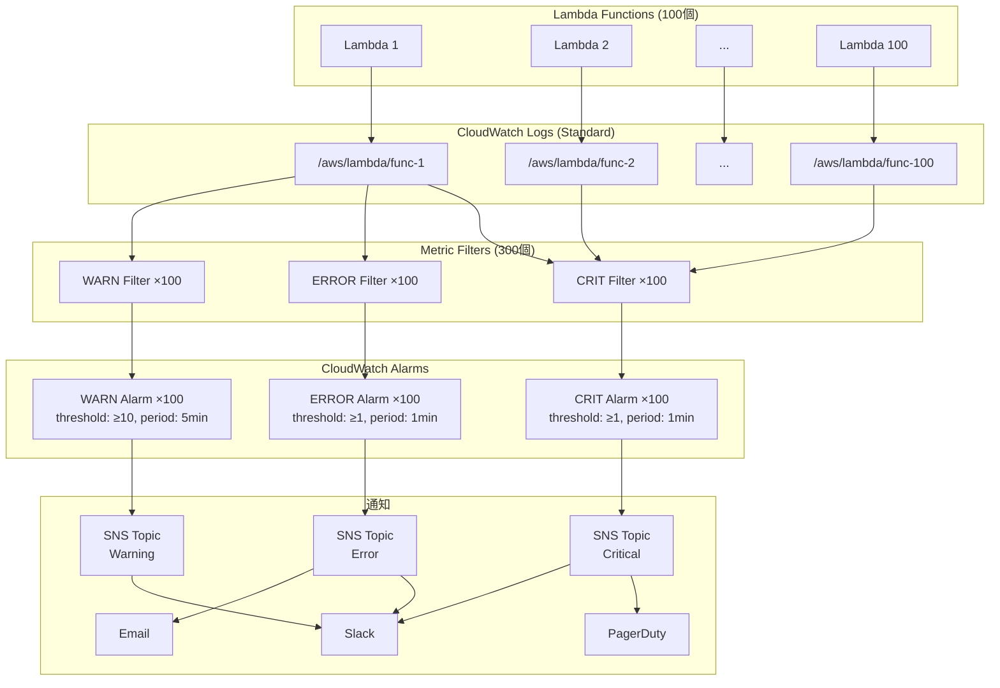
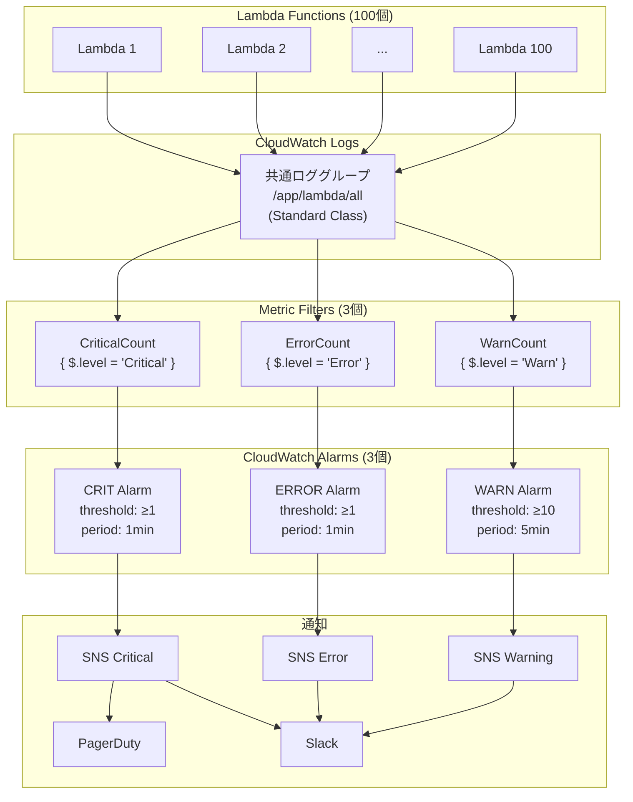
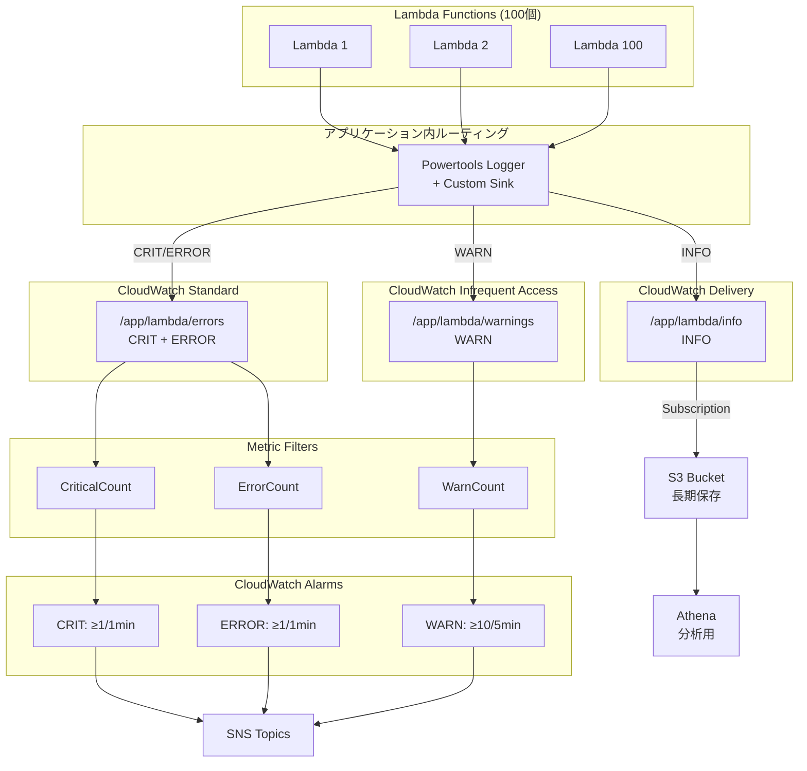
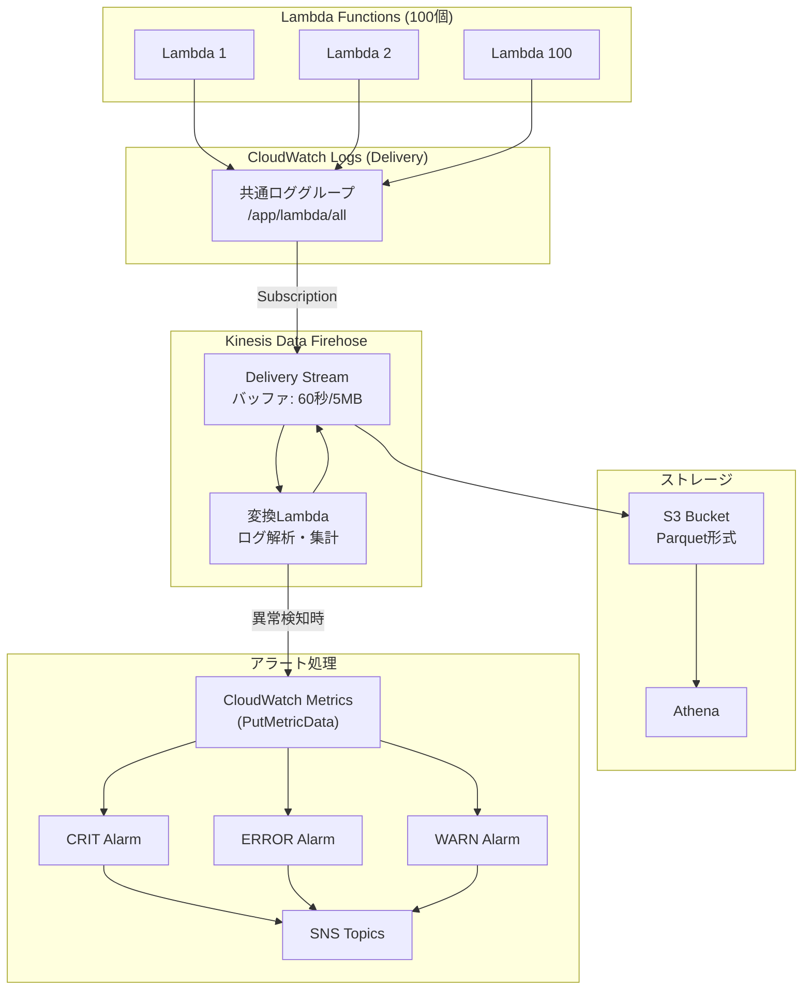
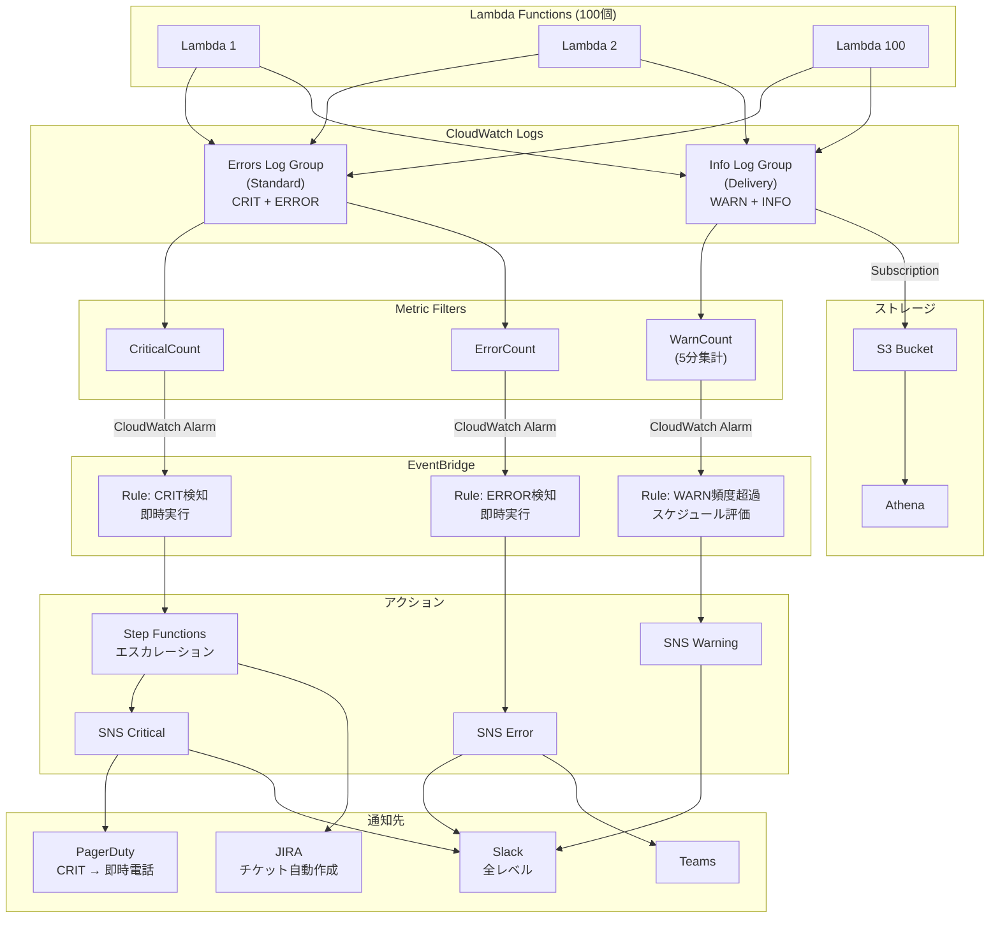

# C# Lambda 100個構成 - ログ管理・アラート実装検討

## 前提条件

| 項目 | 値 |
|------|-----|
| Lambda関数数 | 100個 |
| ランタイム | .NET 8 (C#) |
| 月間ログ量（想定） | 100GB（1関数あたり約1GB） |
| ログレベル分布 | CRIT: 0.1%, ERROR: 1%, WARN: 5%, INFO: 93.9% |
| アラート要件 | CRIT/ERROR: 即時, WARN: 頻度ベース |
| リージョン | ap-northeast-1 (東京) |

## アラート要件詳細

| レベル | 条件 | 通知方法 |
|--------|------|---------|
| **CRITICAL** | 1件発生で即時 | SNS → PagerDuty/Slack |
| **ERROR** | 1件発生で即時 | SNS → Slack/Email |
| **WARN** | 5分間で10件以上 | SNS → Slack |

---

## 構成パターン比較

| # | パターン名 | コスト/月 | 複雑度 | 推奨度 |
|---|-----------|----------|--------|--------|
| 1 | Standard統一 + Metric Filter | ~$53 | ★☆☆ | △ |
| 2 | Centralized Log Group | ~$35 | ★★☆ | ◎ |
| 3 | 階層分離（Standard + IA + S3） | ~$30 | ★★★ | ○ |
| 4 | Firehose集約 + Lambda解析 | ~$32 | ★★☆ | ○ |
| 5 | EventBridge + Metric Stream | ~$28 | ★★★ | ◎ |

---

## パターン1: Standard統一 + Metric Filter

### 概要
最もシンプルな構成。全Lambda が個別のロググループを持ち、Metric Filter でアラートを設定。

### 構成図



### 費用内訳

| 項目 | 計算 | 費用/月 |
|------|------|--------|
| ログ取り込み (Standard) | 100GB × $0.50 | $50.00 |
| ログ保存 (7日) | 100GB × 7/30 × $0.033 | $0.77 |
| Metric Filter | 無料 | $0.00 |
| CloudWatch Alarm | 300個 × $0.10 | $30.00 |
| SNS | ~1000通知 × $0.00 | ~$0.50 |
| **合計** | | **~$81.27** |

### メリット・デメリット

| メリット | デメリット |
|---------|-----------|
| 設定がシンプル | コストが最も高い |
| 関数ごとに独立した監視 | アラーム数が多い (300個) |
| Logs Insights で検索可能 | 管理が煩雑 |

---

## パターン2: Centralized Log Group（推奨）

### 概要
100個のLambdaが共通のロググループを使用。アラームは3個のみで済む。

### 構成図



### 費用内訳

| 項目 | 計算 | 費用/月 |
|------|------|--------|
| ログ取り込み (Standard) | 100GB × $0.50 | $50.00 |
| ログ保存 (7日) | 100GB × 7/30 × $0.033 | $0.77 |
| Metric Filter | 無料 | $0.00 |
| CloudWatch Alarm | 3個 × $0.10 | $0.30 |
| SNS | ~100通知 | ~$0.10 |
| **合計** | | **~$51.17** |

### Terraform 実装例

```hcl
# 共通ロググループ
resource "aws_cloudwatch_log_group" "centralized" {
  name              = "/app/lambda/all"
  retention_in_days = 7
}

# Lambda側の設定 (100個に適用)
resource "aws_lambda_function" "functions" {
  for_each = var.lambda_functions
  
  logging_config {
    log_format = "JSON"
    log_group  = aws_cloudwatch_log_group.centralized.name
  }
}

# Metric Filter - CRITICAL
resource "aws_cloudwatch_log_metric_filter" "critical" {
  name           = "critical-errors"
  pattern        = "{ $.level = \"Critical\" }"
  log_group_name = aws_cloudwatch_log_group.centralized.name

  metric_transformation {
    name          = "CriticalCount"
    namespace     = "App/Lambda"
    value         = "1"
    dimensions    = { FunctionName = "$.function_name" }
  }
}

# Alarm - CRITICAL (即時)
resource "aws_cloudwatch_metric_alarm" "critical" {
  alarm_name          = "lambda-critical-alarm"
  comparison_operator = "GreaterThanOrEqualToThreshold"
  evaluation_periods  = 1
  metric_name         = "CriticalCount"
  namespace           = "App/Lambda"
  period              = 60
  statistic           = "Sum"
  threshold           = 1
  alarm_actions       = [aws_sns_topic.critical.arn]
}

# Alarm - WARN (頻度ベース: 5分で10件以上)
resource "aws_cloudwatch_metric_alarm" "warn" {
  alarm_name          = "lambda-warn-alarm"
  comparison_operator = "GreaterThanOrEqualToThreshold"
  evaluation_periods  = 1
  metric_name         = "WarnCount"
  namespace           = "App/Lambda"
  period              = 300  # 5分
  statistic           = "Sum"
  threshold           = 10   # 10件以上
  alarm_actions       = [aws_sns_topic.warning.arn]
}
```

### メリット・デメリット

| メリット | デメリット |
|---------|-----------|
| アラーム数が最小 (3個) | 全関数が1つのロググループに混在 |
| 管理がシンプル | 関数別の監視が困難 |
| コスト効率が良い | ロググループの上限に注意 |
| Logs Insights で横断検索可能 | |

---

## パターン3: 階層分離（Standard + IA + S3）

### 概要
ログレベルに応じて出力先を分離。ERROR以上は即時監視、WARNはIA、INFOはS3へ。

### 構成図



### 費用内訳

| 項目 | 計算 | 費用/月 |
|------|------|--------|
| **ERROR (Standard, 1.1GB)** | | |
| └ 取り込み | 1.1GB × $0.50 | $0.55 |
| └ 保存 (14日) | 1.1GB × 14/30 × $0.033 | $0.02 |
| **WARN (IA, 5GB)** | | |
| └ 取り込み | 5GB × $0.25 | $1.25 |
| └ 保存 (30日) | 5GB × $0.033 | $0.17 |
| **INFO (Delivery→S3, 93.9GB)** | | |
| └ 取り込み | 93.9GB × $0.25 | $23.48 |
| └ S3保存 | 93.9GB × $0.025 | $2.35 |
| Alarms | 3個 × $0.10 | $0.30 |
| **合計** | | **~$28.12** |

### メリット・デメリット

| メリット | デメリット |
|---------|-----------|
| 最もコスト効率が良い | アプリケーション実装が複雑 |
| レベル別に適切な機能を使用 | 3つのロググループ管理 |
| INFO ログは Athena で分析可能 | Powertools カスタマイズ必要 |

---

## パターン4: Firehose集約 + Lambda解析

### 概要
全ログをFirehose経由でS3に保存しつつ、Lambda関数でリアルタイム解析してアラート。

### 構成図



### 費用内訳

| 項目 | 計算 | 費用/月 |
|------|------|--------|
| ログ取り込み (Delivery) | 100GB × $0.25 | $25.00 |
| Firehose | 100GB × $0.029 | $2.90 |
| 変換Lambda | ~720時間 × $0.0000166667 | $0.01 |
| S3保存 | 100GB × $0.025 | $2.50 |
| PutMetricData | ~50,000回 × $0.01/1000 | $0.50 |
| Alarms | 3個 × $0.10 | $0.30 |
| **合計** | | **~$31.21** |

### メリット・デメリット

| メリット | デメリット |
|---------|-----------|
| 全ログをS3に長期保存 | Firehose + Lambda の複雑さ |
| リアルタイム解析が柔軟 | アラート遅延 (最大60秒) |
| Parquet変換でAthena高速化 | 変換Lambda の保守コスト |

---

## パターン5: EventBridge + Metric Stream（推奨）

### 概要
CloudWatch Metric Streamで高頻度メトリクスを収集、EventBridgeでルールベースのアラート。
最も柔軟で拡張性の高い構成。

### 構成図



### 費用内訳

| 項目 | 計算 | 費用/月 |
|------|------|--------|
| **ERROR (Standard, 1.1GB)** | | |
| └ 取り込み | 1.1GB × $0.50 | $0.55 |
| └ 保存 (14日) | 1.1GB × 14/30 × $0.033 | $0.02 |
| **INFO (Delivery→S3, 98.9GB)** | | |
| └ 取り込み | 98.9GB × $0.25 | $24.73 |
| └ S3保存 | 98.9GB × $0.025 | $2.47 |
| Alarms | 3個 × $0.10 | $0.30 |
| EventBridge Rules | ~1000イベント | ~$0.01 |
| Step Functions | ~100実行 | ~$0.03 |
| **合計** | | **~$28.11** |

### Step Functions によるエスカレーション例

```json
{
  "Comment": "Critical Alert Escalation",
  "StartAt": "NotifySlack",
  "States": {
    "NotifySlack": {
      "Type": "Task",
      "Resource": "arn:aws:states:::sns:publish",
      "Parameters": {
        "TopicArn": "${SNSCriticalTopic}",
        "Message.$": "$.detail"
      },
      "Next": "Wait5Minutes"
    },
    "Wait5Minutes": {
      "Type": "Wait",
      "Seconds": 300,
      "Next": "CheckAcknowledged"
    },
    "CheckAcknowledged": {
      "Type": "Choice",
      "Choices": [
        {
          "Variable": "$.acknowledged",
          "BooleanEquals": true,
          "Next": "Success"
        }
      ],
      "Default": "EscalateToPagerDuty"
    },
    "EscalateToPagerDuty": {
      "Type": "Task",
      "Resource": "arn:aws:states:::lambda:invoke",
      "Parameters": {
        "FunctionName": "pagerduty-integration"
      },
      "Next": "CreateJIRATicket"
    },
    "CreateJIRATicket": {
      "Type": "Task",
      "Resource": "arn:aws:states:::lambda:invoke",
      "Parameters": {
        "FunctionName": "jira-integration"
      },
      "End": true
    },
    "Success": {
      "Type": "Succeed"
    }
  }
}
```

### メリット・デメリット

| メリット | デメリット |
|---------|-----------|
| 最も柔軟なアラート制御 | 設計・実装が複雑 |
| エスカレーション自動化 | 複数サービスの連携管理 |
| コスト効率が良い | 学習コストが高い |
| 将来的な拡張が容易 | |

---

## 総合比較

### 費用比較グラフ

```
費用 ($/月)
    │
 $80├─────────────────────────────────────── ■ P1: $81.27
    │
 $60├───────────────────────────────────────
    │
 $50├─────────────────────────────── ■ P2: $51.17
    │
 $40├───────────────────────────────────────
    │
 $30├───────── ■ P4: $31.21  ■ P3: $28.12  ■ P5: $28.11
    │
 $20├───────────────────────────────────────
    │
    └────────────────────────────────────────
          P1     P2     P3     P4     P5
```

### 機能比較

| 機能 | P1 | P2 | P3 | P4 | P5 |
|------|:--:|:--:|:--:|:--:|:--:|
| 即時アラート (CRIT/ERROR) | ◎ | ◎ | ◎ | ○ | ◎ |
| 頻度ベースアラート (WARN) | ◎ | ◎ | ◎ | ◎ | ◎ |
| Logs Insights 検索 | ◎ | ◎ | ○ | △ | ○ |
| 長期ログ保存 | △ | △ | ◎ | ◎ | ◎ |
| Athena 分析 | × | × | ◎ | ◎ | ◎ |
| エスカレーション | × | × | × | ○ | ◎ |
| 関数別監視 | ◎ | △ | ○ | ○ | ○ |
| 設定の簡潔さ | ◎ | ◎ | △ | △ | × |

### 推奨パターン選択ガイド

```
                    ┌─────────────────────────────────┐
                    │ コスト重視？                      │
                    └───────────────┬─────────────────┘
                           │
              ┌────────────┴────────────┐
              ▼                         ▼
         はい                        いいえ
              │                         │
              ▼                         ▼
    ┌─────────────────┐      ┌─────────────────┐
    │ 高度な通知制御   │      │ シンプルさ重視？ │
    │ が必要？        │      │                 │
    └────────┬────────┘      └────────┬────────┘
             │                        │
    ┌────────┴────────┐      ┌────────┴────────┐
    ▼                 ▼      ▼                 ▼
  はい              いいえ  はい              いいえ
    │                 │      │                 │
    ▼                 ▼      ▼                 ▼
┌─────────┐    ┌─────────┐  ┌─────────┐    ┌─────────┐
│ P5      │    │ P3      │  │ P2      │    │ P1      │
│ 推奨度◎ │    │ 推奨度○ │  │ 推奨度◎ │    │ 推奨度△ │
└─────────┘    └─────────┘  └─────────┘    └─────────┘
```

---

## 最終推奨

### 小〜中規模 (〜50 Lambda): **パターン2（Centralized Log Group）**

- シンプルで管理しやすい
- 費用とのバランスが良い
- 将来的にパターン5への移行も容易

### 大規模 (100+ Lambda): **パターン5（EventBridge + Metric Stream）**

- 最も柔軟なアラート制御
- エスカレーション自動化
- 長期的な運用コスト最適化
- 将来の要件変更に対応しやすい

---

## C# 実装サンプル（パターン5用）

### Powertools を使った構造化ログ

```csharp
using Amazon.Lambda.Core;
using AWS.Lambda.Powertools.Logging;

[assembly: LambdaSerializer(typeof(Amazon.Lambda.Serialization.SystemTextJson.DefaultLambdaJsonSerializer))]

namespace MyLambdaFunction;

public class Function
{
    [Logging(
        LogEvent = true,
        Service = "order-service",
        LogLevel = LogLevel.Information
    )]
    public async Task<APIGatewayProxyResponse> FunctionHandler(
        APIGatewayProxyRequest request,
        ILambdaContext context)
    {
        // 構造化ログに追加のコンテキストを付与
        Logger.AppendKey("orderId", request.PathParameters["id"]);
        Logger.AppendKey("userId", request.RequestContext.Identity.User);
        
        try
        {
            var result = await ProcessOrder(request);
            
            // INFO ログ (S3に保存)
            Logger.LogInformation("Order processed successfully");
            
            return new APIGatewayProxyResponse { StatusCode = 200 };
        }
        catch (PaymentFailedException ex)
        {
            // ERROR ログ (即時アラート)
            Logger.LogError(ex, "Payment processing failed");
            return new APIGatewayProxyResponse { StatusCode = 500 };
        }
        catch (CriticalSystemException ex)
        {
            // CRITICAL ログ (即時アラート + エスカレーション)
            Logger.LogCritical(ex, "Critical system failure - immediate attention required");
            throw;
        }
    }
}
```

### ログ出力例（JSON）

```json
{
  "timestamp": "2026-01-26T23:45:00.000Z",
  "level": "Error",
  "service": "order-service",
  "function_name": "order-processor",
  "function_version": "$LATEST",
  "cold_start": false,
  "xray_trace_id": "1-abcdef12-3456789abcdef0123456789",
  "orderId": "ORD-12345",
  "userId": "user-67890",
  "message": "Payment processing failed",
  "exception": {
    "type": "PaymentFailedException",
    "message": "Gateway timeout",
    "stackTrace": "..."
  }
}
```

---

## 参考情報

### Lambda ログ設定

| トピック | URL |
|---------|-----|
| Lambda ログの操作 | https://docs.aws.amazon.com/lambda/latest/dg/monitoring-logs.html |
| Lambda ロギング設定 API | https://docs.aws.amazon.com/lambda/latest/api/API_LoggingConfig.html |
| JSON/テキストログ形式の設定 | https://docs.aws.amazon.com/lambda/latest/dg/monitoring-cloudwatchlogs-logformat.html |
| CloudWatch ロググループの設定 | https://docs.aws.amazon.com/lambda/latest/dg/monitoring-cloudwatchlogs-loggroups.html |
| C# Lambda のログとモニタリング | https://docs.aws.amazon.com/lambda/latest/dg/csharp-logging.html |
| Lambda を S3 に送信 | https://docs.aws.amazon.com/lambda/latest/dg/logging-with-s3.html |

### CloudWatch Logs

| トピック | URL |
|---------|-----|
| ログクラス（Standard/IA/Delivery） | https://docs.aws.amazon.com/AmazonCloudWatch/latest/logs/CloudWatch_Logs_Log_Classes.html |
| CloudWatch Logs の概念 | https://docs.aws.amazon.com/AmazonCloudWatch/latest/logs/CloudWatchLogsConcepts.html |
| CloudWatch Logs の請求とコスト | https://docs.aws.amazon.com/AmazonCloudWatch/latest/logs/LogsBillingDetails.html |
| サブスクリプションフィルター | https://docs.aws.amazon.com/AmazonCloudWatch/latest/logs/Subscriptions.html |
| ロググループレベルのサブスクリプション | https://docs.aws.amazon.com/AmazonCloudWatch/latest/logs/SubscriptionFilters.html |

### Metric Filter & アラーム

| トピック | URL |
|---------|-----|
| ログイベントからメトリクスを作成 | https://docs.aws.amazon.com/AmazonCloudWatch/latest/logs/MonitoringLogData.html |
| Metric Filter のパターン構文 | https://docs.aws.amazon.com/AmazonCloudWatch/latest/logs/FilterAndPatternSyntaxForMetricFilters.html |
| フィルターパターン構文（全般） | https://docs.aws.amazon.com/AmazonCloudWatch/latest/logs/FilterAndPatternSyntax.html |
| MetricFilter API リファレンス | https://docs.aws.amazon.com/AmazonCloudWatchLogs/latest/APIReference/API_MetricFilter.html |
| PutSubscriptionFilter API | https://docs.aws.amazon.com/AmazonCloudWatchLogs/latest/APIReference/API_PutSubscriptionFilter.html |
| SubscriptionFilter API リファレンス | https://docs.aws.amazon.com/AmazonCloudWatchLogs/latest/APIReference/API_SubscriptionFilter.html |

### CloudWatch アラーム

| トピック | URL |
|---------|-----|
| PutMetricAlarm API | https://docs.aws.amazon.com/AmazonCloudWatch/latest/APIReference/API_PutMetricAlarm.html |
| MetricAlarm API リファレンス | https://docs.aws.amazon.com/AmazonCloudWatch/latest/APIReference/API_MetricAlarm.html |
| 異常検出ベースのアラーム作成 | https://docs.aws.amazon.com/AmazonCloudWatch/latest/monitoring/Create_Anomaly_Detection_Alarm.html |
| アラーム状態変更時のアクション | https://docs.aws.amazon.com/AmazonCloudWatch/latest/monitoring/Acting_Alarm_Changes.html |
| アラームのベストプラクティス | https://docs.aws.amazon.com/AmazonCloudWatch/latest/monitoring/Best-Practice-Alarms.html |
| CloudWatch アラームオプション | https://docs.aws.amazon.com/prescriptive-guidance/latest/implementing-logging-monitoring-cloudwatch/alarming-options-cloudwatch.html |

### EventBridge 連携

| トピック | URL |
|---------|-----|
| CloudWatch アラームイベント | https://docs.aws.amazon.com/eventbridge/latest/ref/events-ref-cloudwatch.html |
| CloudWatch Monitoring イベント | https://docs.aws.amazon.com/eventbridge/latest/ref/events-ref-monitoring.html |

### Powertools for AWS Lambda (.NET)

| トピック | URL |
|---------|-----|
| Powertools Logging 名前空間 | https://docs.aws.amazon.com/powertools/dotnet/api/api/AWS.Lambda.Powertools.Logging.html |
| LoggingAttribute クラス | https://docs.aws.amazon.com/powertools/dotnet/api/api/AWS.Lambda.Powertools.Logging.LoggingAttribute.html |
| Powertools 公式ドキュメント | https://docs.powertools.aws.dev/lambda/dotnet/ |

### コスト最適化

| トピック | URL |
|---------|-----|
| Lambda ログの階層型料金（発表記事） | https://aws.amazon.com/blogs/compute/aws-lambda-introduces-tiered-pricing-for-amazon-cloudwatch-logs-and-additional-logging-destinations/ |
| CloudWatch 料金 | https://aws.amazon.com/cloudwatch/pricing/ |
| CloudWatch コスト分析・削減 | https://docs.aws.amazon.com/AmazonCloudWatch/latest/monitoring/cloudwatch_billing.html |
| サーバーレスアプリのログ取り込みとストレージ | https://docs.aws.amazon.com/wellarchitected/latest/serverless-applications-lens/logging-ingestion-and-storage.html |

### Firehose 連携

| トピック | URL |
|---------|-----|
| Firehose へのログイベントフロー検証 | https://docs.aws.amazon.com/AmazonCloudWatch/latest/logs/ValidateLogEventFlowFirehose.html |
| アカウントレベルのフロー検証 | https://docs.aws.amazon.com/AmazonCloudWatch/latest/logs/ValidateLogEventFlowFirehose-Account.html |

### その他

| トピック | URL |
|---------|-----|
| CloudWatch Pipelines | https://docs.aws.amazon.com/AmazonCloudWatch/latest/monitoring/cloudwatch-pipelines.html |
| ログデータをフィルターパターンで検索 | https://docs.aws.amazon.com/AmazonCloudWatch/latest/logs/SearchDataFilterPattern.html |
| ログ異常検出アラーム | https://docs.aws.amazon.com/AmazonCloudWatch/latest/logs/LogsAnomalyDetection-Alarms.html |
